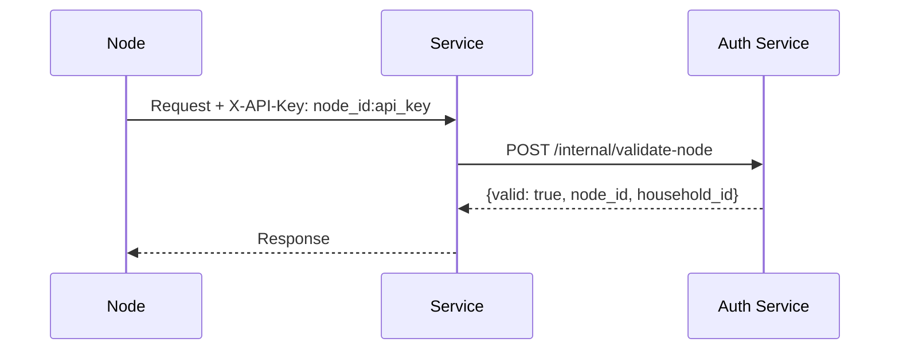
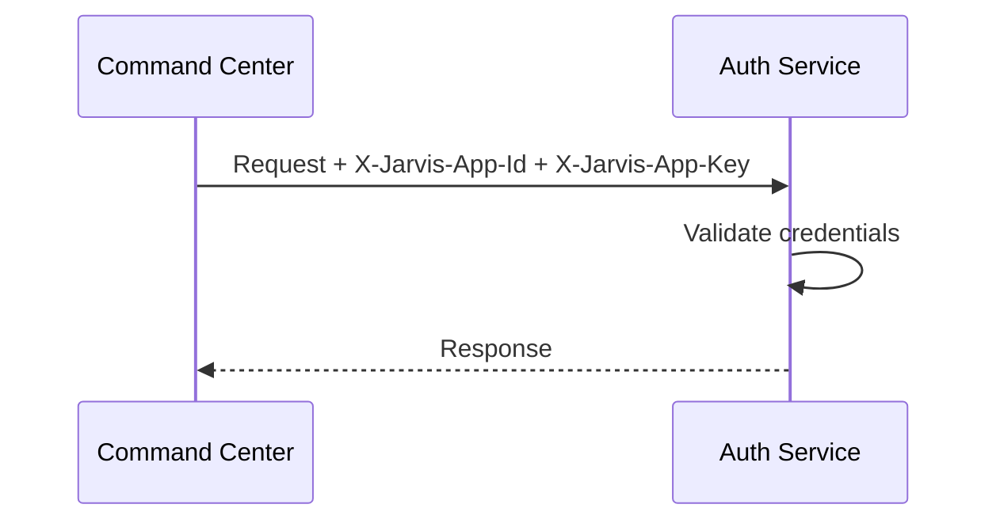
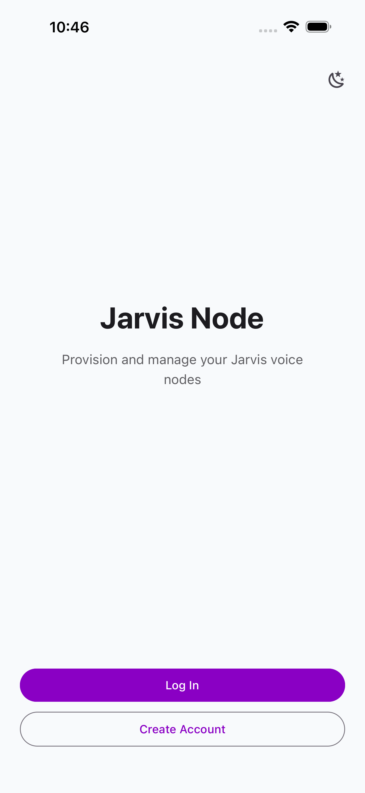
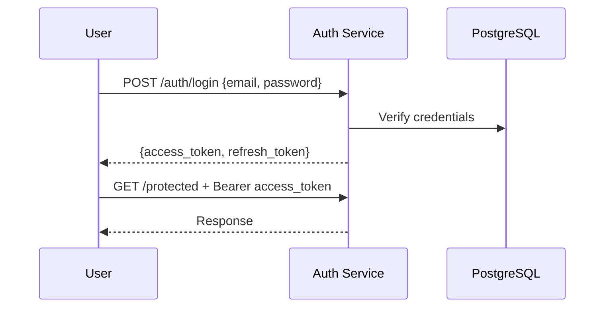

# Authentication

Jarvis uses three authentication patterns depending on who is communicating with whom.

## 1. Node Authentication

Pi Zero nodes authenticate to services using an API key:

```
Header: X-API-Key: {node_id}:{api_key}
```

The receiving service forwards these credentials to `jarvis-auth` for validation.



### Node Registration

Nodes are registered via the admin API during provisioning:

```bash
python utils/authorize_node.py \
  --cc-key <admin_key> \
  --household-id <uuid> \
  --room office \
  --name dev-mac \
  --update-config config.json
```

This generates a unique `node_id` and `api_key` pair, stores them in the auth database, and optionally writes them to the node's config file.

## 2. App-to-App Authentication

Backend services authenticate to each other using app credentials:

```
Headers:
  X-Jarvis-App-Id: jarvis-command-center
  X-Jarvis-App-Key: <shared_secret>
```



App credentials are generated during `./jarvis init` and stored in each service's `.env` file. Each service has its own unique app ID and key pair.

### Which Services Use App-to-App Auth

Most inter-service communication uses this pattern:

- Command Center to Auth, Whisper, TTS, Notifications
- OCR Service to Auth
- Recipes Server to Auth, OCR Service
- Logs to Auth (for validating incoming log requests)
- Config Service to Auth

## 3. User Authentication (JWT)

Human users (admin UI, mobile app) authenticate with JWT tokens:

```
Header: Authorization: Bearer <jwt_token>
```

### Login Flow

<div class="screenshot-grid" markdown>

<figure markdown>
  { width="240" loading=lazy }
  <figcaption>Landing screen</figcaption>
</figure>

<figure markdown>
  { width="240" loading=lazy }
  <figcaption>Login form</figcaption>
</figure>

</div>



### Token Lifecycle

- **Access tokens** are short-lived JWTs (configurable expiry)
- **Refresh tokens** are long-lived, stored as hashed values in PostgreSQL
- When an access token expires, the client uses the refresh token to obtain a new pair
- Logout invalidates the refresh token server-side

### Token Refresh

```bash
curl -X POST http://localhost:7701/auth/refresh \
  -d '{"refresh_token": "<refresh_token>"}'
# Returns: {access_token, refresh_token}
```

## 4. Admin Authentication

Administrative endpoints (service management, node registration) use a static admin key:

```
Header: X-Admin-Key: <admin_api_key>
```

The admin key is set via the `ADMIN_API_KEY` environment variable on each service that exposes admin endpoints.

## Auth Flow Summary

| Who | What | Pattern | Headers |
|-----|------|---------|---------|
| Node | Service | API Key | `X-API-Key: node_id:api_key` |
| Service | Service | App-to-App | `X-Jarvis-App-Id` + `X-Jarvis-App-Key` |
| User | Service | JWT Bearer | `Authorization: Bearer <token>` |
| Admin | Service | Admin Key | `X-Admin-Key: <admin_api_key>` |

## Security Notes

- All secrets are stored in `.env` files which are gitignored
- Passwords are hashed before storage (never stored in plaintext)
- Refresh tokens are stored as hashed values in PostgreSQL
- App-to-app credentials are unique per service pair
- Node API keys are generated with cryptographic randomness during registration
