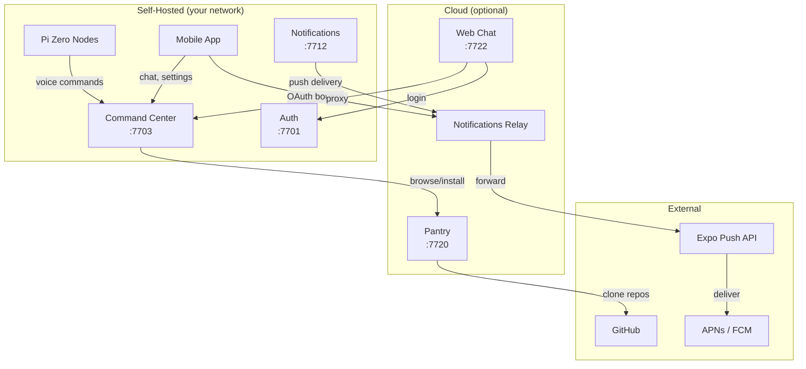
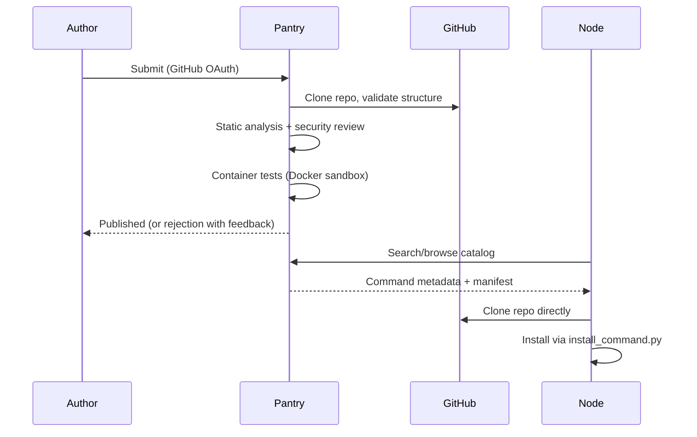
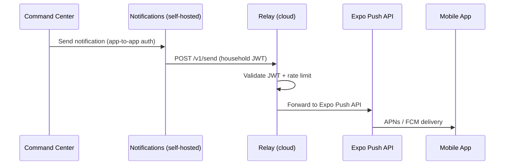

# Cloud Services

Jarvis is self-hosted first --- every service can run on your own hardware. But three services are designed to optionally run on cloud infrastructure, providing capabilities that benefit from public internet access.

## Architecture



## Design Principles

**No data leaves your network by default.** Cloud services are opt-in and handle only what they must:

- **Pantry** serves a catalog and validates submissions --- your command code runs locally, never on Pantry servers
- **Relay** forwards push notification payloads to Expo --- it never stores messages, and rate-limits aggressively
- **Web** is a thin proxy to your command center --- all processing happens on your self-hosted infrastructure

Each cloud service is stateless or nearly so, meaning you can run your own instance or use a shared one.

---

## Pantry (Command Store)

> The community marketplace. Authors publish commands; users browse and install them with one CLI command.

**Port:** 7720 | **Stack:** FastAPI + PostgreSQL | **Auth:** GitHub OAuth (authors) + household JWT (nodes)

Pantry is the HACS-style command store for Jarvis. It hosts a catalog of community-built commands, agents, device protocols, and device managers that any node can install.

### How It Works



### Submission Pipeline

Every submission goes through a multi-stage validation pipeline before it reaches the catalog:

1. **Structure validation** --- correct directory layout, `manifest.json` present, required files exist
2. **Static analysis** --- imports checked against allowlist, no `subprocess`/`eval`/`exec`, interfaces properly implemented
3. **AI security review** --- LLM-based code review using the submitter's own API key (BYOK, no Jarvis API key needed)
4. **Container tests** --- components instantiated in a Docker sandbox (128MB RAM, 0.5 CPU, read-only filesystem, no network)
5. **Publish** --- added to catalog with `pending_review` status until an admin verifies

### Bundles

A single Pantry package can include multiple component types:

```
my-smart-home-package/
    manifest.json
    commands/
        control_widget.py      # IJarvisCommand
    agents/
        widget_monitor.py      # IJarvisAgent
    device_families/
        widget_protocol.py     # IJarvisDeviceProtocol
    device_managers/
        widget_manager.py      # IJarvisDeviceManager
```

The manifest declares which components are included. The node's `install_command.py` handles dependency resolution and secret seeding for the entire bundle.

### CLI

```bash
jarvis pantry search "weather"          # Search the catalog
jarvis pantry info smart-weather        # View details + reviews
jarvis pantry install smart-weather     # Install to your node
jarvis pantry install --local ./my-cmd  # Install from local directory (dev)
jarvis pantry remove smart-weather      # Uninstall
jarvis pantry list                      # List installed packages
jarvis pantry update --all              # Update all installed packages
```

### API Endpoints

| Endpoint | Method | Auth | Description |
|----------|--------|------|-------------|
| `/v1/commands` | GET | None | Browse and search the catalog |
| `/v1/commands/{name}` | GET | None | Command details, versions, reviews |
| `/v1/commands/{name}/download` | GET | JWT | Download info (clone URL, manifest) |
| `/v1/commands` | POST | GitHub OAuth | Submit a new command |
| `/v1/commands/{name}/reviews` | GET/POST | JWT | List or submit reviews |
| `/v1/commands/{name}/installed` | POST | JWT | Track installation |
| `/v1/admin/commands/{name}/verify` | POST | Admin | Admin verification |

---

## Notifications Relay

> The postman. Receives push requests from your self-hosted notifications service and delivers them to phones via Expo.

**Stack:** FastAPI (stateless) | **Auth:** Household JWT | **Target:** Fly.io / Cloudflare Workers

The relay exists because Apple Push Notification service (APNs) and Firebase Cloud Messaging (FCM) require a publicly reachable server. Rather than exposing your self-hosted infrastructure, the relay acts as a minimal, stateless proxy.

### How It Works



### Rate Limiting

The relay protects against abuse with layered rate limits:

| Scope | Limit | Window |
|-------|-------|--------|
| Per household | 100 requests | 1 hour |
| Per device token | 20 requests | 1 hour |
| Burst | 10 requests | 1 second |

Repeated limit violations trigger escalating responses: warning at 3 consecutive 429s, error logging at 6, and a 1-hour suspension at 10.

### OAuth Bounce

The relay also handles OAuth callback redirects. When a mobile user authenticates with an external provider (e.g., Google), the provider redirects to the relay, which bounces the authorization code to the mobile app via a custom URL scheme:

```
Provider → GET /oauth/bounce?code=xxx&state=yyy
Relay    → 302 redirect to jarvis://oauth/callback?code=xxx&state=yyy
Mobile   → Receives code, exchanges for tokens locally
```

This avoids exposing your self-hosted auth service to the public internet.

### API Endpoints

| Endpoint | Method | Auth | Description |
|----------|--------|------|-------------|
| `/health` | GET | None | Health check |
| `/v1/send` | POST | Household JWT | Forward push notification to Expo |
| `/oauth/bounce` | GET | None | OAuth callback redirect |

---

## Web Chat

> A browser-based interface to talk to Jarvis --- no Pi Zero required.

**Port:** 7722 | **Stack:** Next.js + React + Tailwind CSS | **Auth:** JWT (via jarvis-auth)

Web Chat provides a chat interface that connects directly to the command center. It is useful for testing commands during development, for users who do not have a Pi Zero node, or as a secondary interface alongside voice.

### Architecture

Web Chat is a thin client. All intelligence lives in the command center --- the web app just proxies requests:

```
Browser → Next.js (:7722) → Command Center (:7703)
                           → Auth (:7701)
```

- **No direct LLM access** --- messages go through the command center's full pipeline (tool routing, validation, execution)
- **SSE streaming** --- responses stream in real-time via Server-Sent Events
- **Node selector** --- choose which node's command set to use (each node may have different commands installed)

### API Proxy Routes

| Browser Path | Proxied To |
|-------------|------------|
| `/api/auth/*` | `jarvis-auth:7701/auth/*` |
| `/api/cc/*` | `jarvis-command-center:7703/api/v0/*` |

---

## Command SDK

> The contract. A pure-Python library that defines every interface a Pantry package can implement.

**Package:** `jarvis-command-sdk` | **Install:** `pip install jarvis-command-sdk`

The SDK contains the abstract base classes for all plugin types. Community packages import from the SDK rather than from `jarvis-node-setup` directly, keeping the dependency lightweight and stable.

### Exported Interfaces

| Interface | Role | Description |
|-----------|------|-------------|
| `IJarvisCommand` | The Specialists | Voice command handlers |
| `IJarvisAgent` | The Coordinators | Background scheduled tasks |
| `IJarvisDeviceProtocol` | The Translators | LAN/cloud device adapters |
| `IJarvisDeviceManager` | The Stewards | Device discovery backends |

### Supporting Classes

Commands: `PreRouteResult`, `CommandExample`, `CommandResponse`, `JarvisParameter`, `JarvisSecret`, `JarvisPackage`, `RequestInformation`, `ValidationResult`

Agents: `AgentSchedule`, `Alert`

Devices: `DiscoveredDevice`, `DeviceControlResult`, `DeviceManagerDevice`

### Usage

```python
from jarvis_command_sdk import IJarvisCommand, CommandResponse, JarvisParameter

class MyCommand(IJarvisCommand):
    @property
    def command_name(self) -> str:
        return "my_command"
    # ... implement the interface
```

The SDK has zero external dependencies. Node-side code in `jarvis-node-setup` re-exports from `core.*` for backwards compatibility, so existing commands do not need to change their imports.

---

## Deployment

All cloud services can run self-hosted (same Docker containers as everything else) or on cloud infrastructure:

| Service | Self-Hosted | Cloud Target | Notes |
|---------|-------------|--------------|-------|
| Pantry | Docker + PostgreSQL | Any VPS | Needs GitHub OAuth app credentials |
| Relay | Docker | Fly.io / Cloudflare | Stateless, no database |
| Web Chat | Docker / `npm run start` | Vercel / any Node.js host | Needs access to CC + Auth |
| SDK | PyPI package | N/A | Library, not a service |

The `jarvis` CLI manages cloud services the same way as local ones:

```bash
jarvis start jarvis-pantry          # Start Pantry locally
jarvis start jarvis-web             # Start Web Chat locally
jarvis health jarvis-pantry         # Check health
```
