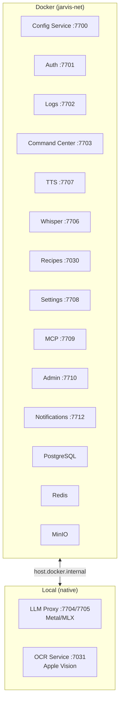

# Deployment

Jarvis uses a mixed local/Docker model that adapts to the host platform.

## macOS (Apple Silicon)

GPU-dependent services run **locally** to access Metal and Apple Vision frameworks. Everything else runs in Docker.



The `jarvis` CLI detects Darwin and automatically overrides `mode=docker` to `mode=local` for `llm-proxy` and `ocr-service`. No manual configuration needed.

### How Docker and Local Services Communicate

- Docker containers reach local services via `host.docker.internal` (configured with `extra_hosts` in compose files)
- Local services reach Docker infrastructure (PostgreSQL, Redis) via `localhost` (ports are bound to the host)
- `JARVIS_CONFIG_URL_STYLE=dockerized` tells config-service to return appropriate URLs for each consumer

## Linux (NVIDIA GPU)

Everything runs in Docker, including GPU services. LLM inference uses the [NVIDIA Container Toolkit](https://docs.nvidia.com/datacenter/cloud-native/container-toolkit/overview.html) for GPU passthrough.

```yaml
# In docker-compose.yaml
services:
  jarvis-llm-proxy-api:
    deploy:
      resources:
        reservations:
          devices:
            - driver: nvidia
              count: all
              capabilities: [gpu]
```

On the production server (dual NVIDIA 3090s, 48GB total VRAM), the LLM proxy uses llama.cpp with GGUF models for inference.

## Infrastructure Services

All deployments include these shared infrastructure containers:

| Service | Port | Purpose |
|---------|------|---------|
| PostgreSQL | 5432 | Primary database for auth, command-center, config, recipes, notifications |
| Redis | 6379 | Queue and cache for OCR jobs and async processing |
| MinIO | 9000 | S3-compatible object storage |
| Mosquitto | 1883 | MQTT broker for node-to-TTS audio delivery |

## Network Modes

The `./jarvis` CLI supports three network modes:

| Mode | Flag | How Services Communicate |
|------|------|--------------------------|
| **Bridge** (default) | -- | Shared `jarvis-net` Docker network. Services use container names. |
| **Host** | `--no-network` | No shared Docker network. Services use `host.docker.internal`. |
| **Standalone** | `--standalone` | Single service with its own PostgreSQL container. For isolated development. |

## Docker Compose Files

Each service has its own `docker-compose.yaml` (or `docker-compose.dev.yaml` for development). The `jarvis` CLI orchestrates them:

```bash
./jarvis start --all          # Start all services
./jarvis stop --all           # Stop all services
./jarvis rebuild jarvis-auth  # Rebuild and restart one service
```

Development compose files typically include:

- Volume mounts for live code reloading (`./app:/app/app`)
- Development environment variables
- Debug ports and logging configuration

## Startup Order

Services must start in tier order to respect dependencies:

| Order | Tier | Services |
|-------|------|----------|
| 1 | Tier 0 -- Foundation | Config Service, PostgreSQL, Redis, MinIO, Mosquitto |
| 2 | Tier 1 -- Infrastructure | Auth, Logs |
| 3 | Tier 2 -- Core | Command Center, LLM Proxy |
| 4 | Tier 3 -- Specialized | Whisper, TTS, OCR, Recipes, Notifications |
| 5 | Tier 4 -- Management | Settings Server, MCP, Admin UI |

The `jarvis` CLI handles this ordering automatically. Each service waits for its dependencies to be healthy before accepting requests.

## Environment Configuration

Each service reads its configuration from a `.env` file. Common variables:

| Variable | Used By | Description |
|----------|---------|-------------|
| `DATABASE_URL` | auth, command-center, recipes, config, notifications | PostgreSQL connection string |
| `SECRET_KEY` | auth | JWT signing key |
| `ADMIN_API_KEY` | command-center | Admin endpoint protection |
| `JARVIS_AUTH_BASE_URL` | all services | Auth service URL for validation |
| `JARVIS_CONFIG_URL` | all services | Config service URL for discovery |

Services also store app-to-app credentials (`JARVIS_APP_ID`, `JARVIS_APP_KEY`) for authenticating with other services.

## Database Migrations

All services with PostgreSQL use [Alembic](https://alembic.sqlalchemy.org/) for schema migrations:

```bash
# Run pending migrations
cd jarvis-<service>
.venv/bin/python -m alembic upgrade head

# Generate a new migration
.venv/bin/python -m alembic revision --autogenerate -m "add users table"
```

Docker dev scripts run migrations automatically on container startup.
