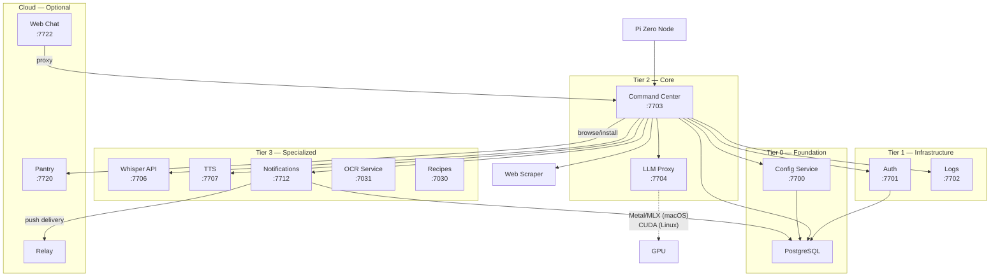
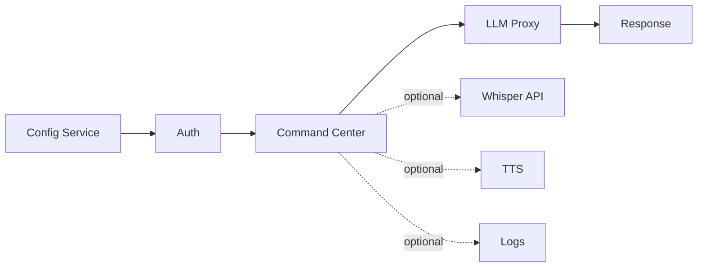

# Architecture Overview

Jarvis is a distributed voice assistant built from small, focused microservices. Pi Zero nodes capture voice input, a central command center orchestrates processing, and specialized services handle speech-to-text, LLM inference, text-to-speech, and more.

## System Diagram

## Dependency Tiers

Services are organized into tiers based on how many other services depend on them. Lower tiers must start first.

| Tier | Name | Services | Role |
|------|------|----------|------|
| **0** | Foundation | Config Service (7700), PostgreSQL | Service discovery and persistent storage. Every other service depends on these. |
| **1** | Infrastructure | Auth (7701), Logs (7702) | Authentication and observability. Most services require auth; logs degrade gracefully if unavailable. |
| **2** | Core | Command Center (7703), LLM Proxy (7704/7705) | Voice command orchestration and LLM inference. The main processing pipeline. |
| **3** | Specialized | Whisper (7706), TTS (7707), OCR (7031), Recipes (7030), Notifications (7712) | Domain-specific services called by the command center as needed. |
| **4** | Management | Settings Server (7708), MCP (7709), Admin UI (7710) | Developer and admin tooling. No runtime services depend on these. |
| **Cloud** | Cloud (optional) | Pantry (7720), Notifications Relay, Web Chat (7722) | Services that benefit from public internet access. Can run self-hosted or on cloud infrastructure. See [Cloud Services](cloud.md). |
| **5** | Clients | Pi Zero nodes, mobile app | End-user devices that connect to the command center. |

## Critical Path for Voice Commands

For a voice command to flow from microphone to speaker, these services must be running:

| Service | Required? | Impact if Down |
|---------|-----------|----------------|
| Config Service | Yes | No service can discover other services |
| Auth | Yes | No authentication, all requests rejected |
| Command Center | Yes | No voice command processing |
| LLM Proxy | Yes | No intent classification or response generation |
| Whisper API | Conditional | No speech-to-text (needed if nodes send audio) |
| TTS | Conditional | No spoken responses (text responses still work) |
| Logs | No | Services continue; logs fall back to console |

## Architectural Principles

### FastAPI + Uvicorn Everywhere

Every Python service uses [FastAPI](https://fastapi.tiangolo.com/) with Uvicorn as the ASGI server. This provides:

- Automatic OpenAPI documentation at `/docs`
- Async request handling
- Pydantic validation on all request/response models

### PostgreSQL for Persistent Data

Auth, Command Center, Config Service, Recipes, and Notifications all use PostgreSQL. Schema migrations are managed with [Alembic](https://alembic.sqlalchemy.org/).

### JWT Authentication

Three auth patterns cover all communication needs:

- **Node auth**: API keys (`X-API-Key` header)
- **App-to-app auth**: Service credentials (`X-Jarvis-App-Id` + `X-Jarvis-App-Key` headers)
- **User auth**: JWT bearer tokens (`Authorization: Bearer <token>`)

See [Authentication](authentication.md) for details.

### Docker Containers

All services run in Docker containers orchestrated by Docker Compose. GPU-dependent services may run locally on macOS to access Metal/MLX. See [Deployment](deployment.md) for platform-specific details.

### Centralized Logging

All services use `jarvis-log-client` to send structured logs to `jarvis-logs` (backed by Loki + Grafana). No `print()` statements in production code.

### Service Discovery

Services register with and discover each other through `jarvis-config-service`. No hardcoded URLs between services. See [Service Discovery](service-discovery.md) for details.

## Service Inventory

| Service | Port | Description |
|---------|------|-------------|
| Config Service | 7700 | Service discovery and registration |
| Auth | 7701 | JWT authentication, node registration, app credentials |
| Logs | 7702 | Centralized structured logging (Loki + Grafana) |
| Command Center | 7703 | Voice command orchestration, tool routing, memory |
| LLM Proxy | 7704/7705 | LLM inference (MLX on macOS, llama.cpp/vLLM on Linux) |
| Whisper API | 7706 | Speech-to-text via whisper.cpp with speaker identification |
| TTS | 7707 | Text-to-speech via Piper TTS |
| Settings Server | 7708 | Runtime settings aggregation |
| MCP | 7709 | Claude Code tool integration |
| Admin UI | 7710 | Web administration interface |
| Notifications | 7712 | Push notifications, inbox, device tokens |
| Recipes | 7030 | Recipe CRUD, meal planning, OCR import |
| OCR Service | 7031 | Image-to-text (Apple Vision on macOS, Tesseract on Linux) |
| Pantry | 7720 | Community package store (commands, agents, device adapters, routines) |
| Notifications Relay | --- | Stateless Expo Push API proxy for push delivery |
| Web Chat | 7722 | Browser-based chat interface to the command center |
