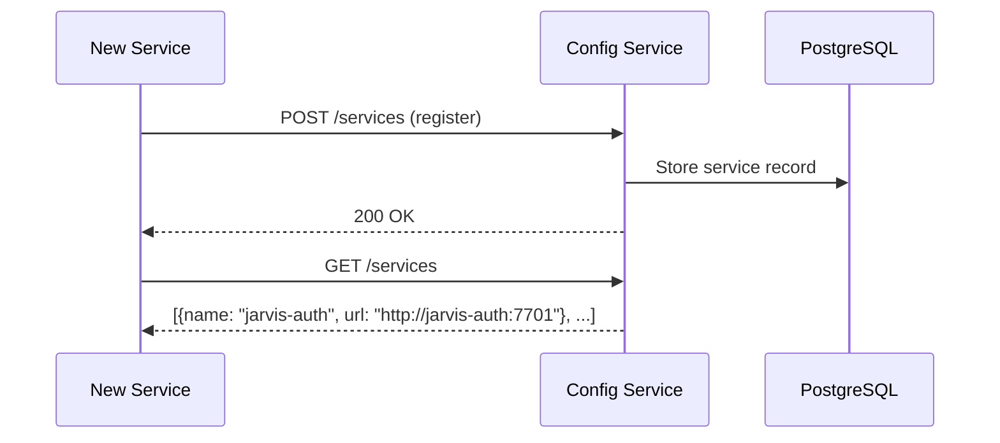

# Service Discovery

All Jarvis services find each other through `jarvis-config-service` (port 7700). No service hardcodes the URL of another service.

## How It Works

On startup, each service:

1. **Registers** itself with config-service (name, port, health endpoint path)
2. **Queries** for the URLs of its dependencies
3. **Caches** discovered URLs locally, refreshing periodically



## URL Resolution

Config service returns different URLs depending on the network mode. This is controlled by the `JARVIS_CONFIG_URL_STYLE` environment variable.

| URL Style | URL Format | Use Case |
|-----------|------------|----------|
| *(default)* | Container name (`http://jarvis-auth:7701`) | Docker container talking to another Docker container on the shared network |
| `dockerized` | Host gateway (`http://host.docker.internal:7701`) | Docker container talking to a service running locally on the host |
| `external` | Published external coordinates (e.g. `http://localhost:7701`) | Off-box or native consumers that cannot resolve `host.docker.internal` — e.g. a native macOS service (TTS, Whisper, Admin) running outside Docker via launchd, or a LAN voice node. Requires `jarvis-config-client` ≥ 0.2.1. |

### Why This Matters

On macOS, GPU-dependent services (LLM Proxy, OCR) and some app-authenticated services (TTS, Whisper, Admin) run natively to access Metal/Apple Vision or host-published ports, while everything else runs in Docker. A native process cannot resolve `host.docker.internal`, so it must request the `external` style to reach its Docker peers via their host-published `localhost` ports.

The config service handles this automatically based on how it is configured.

## Network Modes

The `./jarvis` CLI supports three network modes:

| Mode | Flag | How Services Communicate |
|------|------|--------------------------|
| **Bridge** (default) | -- | Shared `jarvis-net` Docker network. Services use container names. |
| **Host** | `--no-network` | No shared Docker network. Services use `host.docker.internal`. |
| **Standalone** | `--standalone` | Single service with its own PostgreSQL container. For isolated development. |

## Client Library

Services use `jarvis-config-client` to interact with config-service:

```python
from jarvis_config_client import ConfigClient

client = ConfigClient()
auth_url = client.get_service_url("jarvis-auth")
```

The client handles:

- Initial service registration on startup
- URL caching with periodic refresh
- Fallback to environment variables if config-service is unreachable

## Config Service as Tier 0

Config service is a **Tier 0** dependency -- it must be running before any other service can start. If config-service is down:

- New services cannot register or discover other services
- Running services continue with their cached URLs until the cache expires
- Services with hardcoded fallback URLs (via environment variables) continue unaffected

## Service Health Checks

Config service stores health endpoint paths for each registered service. The MCP server and admin UI use this to aggregate health status across the entire system.
