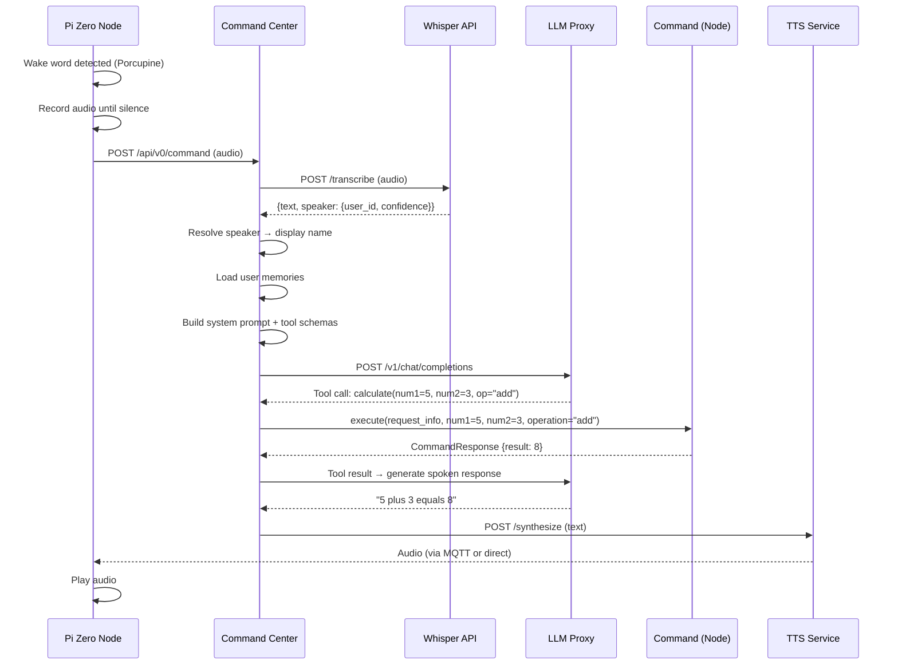

# Voice Pipeline

The voice pipeline is the core interaction flow -- from microphone to speaker.

## Sequence



## Pipeline Stages

### 1. Wake Word Detection

Local on the Pi Zero using [Porcupine](https://picovoice.ai/platform/porcupine/). No audio leaves the device until the wake word is detected. This is a core privacy guarantee -- the node only starts recording after hearing the configured wake word.

### 2. Speech-to-Text (Whisper)

Audio is sent to `jarvis-whisper-api` which runs [whisper.cpp](https://github.com/ggerganov/whisper.cpp). Returns transcription text plus optional speaker identification with a confidence score.

Key files:

- Node: `stt_providers/jarvis_whisper_client.py` (`TranscriptionResult` with speaker data)
- Whisper: `app/api/voice_profiles.py` (enrollment endpoints)

### 3. Speaker Resolution

Command Center resolves the speaker's `user_id` to a display name via `jarvis-auth`. Names are cached for 5 minutes to avoid repeated lookups.

Key file: `jarvis-command-center/app/core/utils/speaker_resolver.py`

### 4. Memory Injection

User-specific memories are loaded from PostgreSQL and injected into the system prompt. The LLM sees context like:

> About Alex: likes black coffee, morning person

Users can manage memories through voice commands ("remember that I like black coffee") or the REST API.

Key files:

- `jarvis-command-center/app/services/memory_service.py` (memory CRUD + prompt formatting)
- `jarvis-command-center/app/core/tools/remember_tool.py` (remember tool)
- `jarvis-command-center/app/core/tools/forget_tool.py` (forget tool)
- `jarvis-command-center/app/api/memories.py` (REST CRUD API)

### 5. Intent Classification (LLM)

The LLM receives the transcribed text along with all registered command schemas (tool definitions). It selects the appropriate command and extracts parameters.

The command center builds a system prompt containing:

- Current date/time context
- Speaker identity and memories
- All available tool schemas (command definitions with parameter types)

The LLM responds with a tool call specifying the command name and extracted arguments.

### 6. Command Execution

The selected command's `execute()` method runs. Commands implement the `IJarvisCommand` interface:

```python
class IJarvisCommand:
    def execute(self, request_info, **kwargs) -> CommandResponse:
        ...
```

Commands validate secrets and parameters, then call `run()` with the extracted arguments.

### 7. Response Generation

The command's result (`CommandResponse`) is sent back to the LLM to generate a natural language spoken response. This second LLM call turns structured data into conversational speech.

### 8. Text-to-Speech

The spoken response text is sent to `jarvis-tts`, which delegates to a selectable provider: [Piper TTS](https://github.com/rhasspy/piper) for fast/lightweight output (the default, baked into the image) or [Kokoro TTS](https://github.com/hexgrad/kokoro) for more natural prosody. The provider is chosen at runtime via the `tts.provider` setting; see the [TTS service docs](../services/tts.md) for voices and caching. Audio is streamed back to the node as raw 16-bit PCM; the format is carried in `X-Audio-*` response headers so the node plays whatever the provider emits.

## Pre-Routing (Fast Path)

Commands can implement `pre_route()` to claim short, unambiguous utterances without LLM inference:

```python
def pre_route(self, voice_command: str) -> PreRouteResult | None:
    if voice_command.strip().lower() == "pause":
        return PreRouteResult(arguments={}, spoken_response="Paused.")
    return None
```

This skips steps 5-7 entirely, reducing latency to near-zero for simple commands like "pause", "stop", or "nevermind".

## Speaker ID and Memory Flow

```
Node (mic) --> Whisper --> {text, speaker: {user_id, confidence}}
                               |
                               v
             Command Center receives transcription
               |
               +-- Extracts speaker_user_id from whisper response
               +-- Resolves user_id -> display name via jarvis-auth (cached 5min)
               +-- Loads user memories from PostgreSQL (MemoryService)
               +-- Injects speaker name + memories into system prompt
               |
               +-->  LLM sees: "About Alex: - Likes black coffee - Morning person"
                     LLM can call: remember({content: "..."}) / forget({content_match: "..."})
```

## Performance Target

Total end-to-end latency target: **< 5 seconds** including:

- Whisper transcription
- Date context extraction
- Command inference (tool routing)
- Command execution and response
