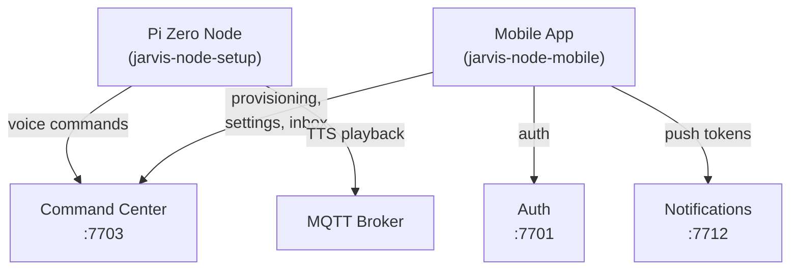

# Clients

Jarvis clients are the end-user software that connects to the backend microservices. They capture voice input, display results, manage nodes, and handle provisioning.

## Client Types

### [Pi Zero Node (jarvis-node-setup)](node-setup.md)

The primary voice interface. Runs on Raspberry Pi Zero hardware with a microphone and speaker. Handles wake word detection, audio capture, and sends voice commands to the command center. Receives spoken responses via MQTT.

### [Mobile App (jarvis-node-mobile)](node-mobile.md)

iOS and Android app built with React Native/Expo. Used for node provisioning (QR code scanning, WiFi setup), settings management, push notifications, and the deep research inbox.

### [Provisioning System](provisioning.md)

Headless provisioning for Pi Zero nodes. When a fresh node boots, it creates a WiFi access point (`jarvis-XXXX`) and waits for the mobile app to configure it with WiFi credentials, encryption keys, and command center registration.

## How Clients Authenticate

| Client | Auth Method | Header |
|--------|-------------|--------|
| Pi Zero Node | Node API key | `X-API-Key: {node_id}:{api_key}` |
| Mobile App | JWT bearer token | `Authorization: Bearer <token>` |
| Provisioning | Provisioning token (one-time) | Via registration payload |

## Client Dependencies

| Client | Required Services | Optional Services |
|--------|-------------------|-------------------|
| Pi Zero Node | Command Center (7703) | TTS (7707), Config Service (7700) |
| Mobile App | Auth (7701), Config Service (7700) | Command Center (7703), Notifications (7712) |
| Provisioning | Command Center (7703), Auth (7701) | — |
