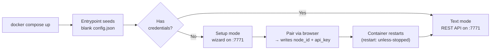

# Node in Docker (Compose)

Besides the [Pi Zero voice node](node-setup.md), Jarvis ships a **containerized node** you can run anywhere Docker runs — a laptop on the LAN, a dev box, or alongside the server stack itself (the demo/kitchen nodes on the prod host run this way). It's the same `jarvis-node-setup` codebase, packaged as an image.

!!! note "This is the text-mode node"
    `ghcr.io/alexberardi/jarvis-node:latest` is the **headless, text-mode** image — no microphone, no wake word, no audio. It exposes a REST API you drive with typed commands (`POST /api/v1/command`), which is ideal for demos, integration tests, and dev. Voice capture needs the separate audio image and host audio devices — see [Voice mode](#voice-mode) below.

## The compose file

A minimal, working single-node deployment:

```yaml title="docker-compose.yml"
services:
  jarvis-node:
    image: ghcr.io/alexberardi/jarvis-node:latest
    container_name: jarvis-demo-node
    ports:
      - "7771:7771"            # setup wizard + node API
    environment:
      - CONFIG_PATH=/config/config.json
      - JARVIS_NODE_PORT=7771
      - JARVIS_NODE_DB=/data/jarvis_node.db
      - JARVIS_SECRET_DIRECTORY=/data
      - JARVIS_CONFIG_URL_STYLE=remote
    volumes:
      - ./config:/config       # directory — the entrypoint seeds config.json inside it
      - jarvis-node-data:/data
      - jarvis-node-packages:/root/.jarvis/packages
    restart: unless-stopped

volumes:
  jarvis-node-data:
  jarvis-node-packages:
```

That's enough to boot an unprovisioned node and pair it through the [setup wizard](#first-boot-provisioning). Read on for what each line does — and, before production use, the [three things this minimal file leaves out](#hardening-the-minimal-compose).

## Environment variables

The image bakes sensible defaults (`CONFIG_PATH`, `JARVIS_NODE_PORT`, and `JARVIS_SKIP_PROVISIONING_CHECK=true`), so most of these are explicit-for-clarity rather than strictly required.

| Variable | Value | What it does |
|---|---|---|
| `CONFIG_PATH` | `/config/config.json` | The node's JSON config — identity (`node_id`, `api_key`), the config-service URL, room, MQTT settings. Seeded from a template on first boot, then filled in by the wizard. Any config key can also be overridden by a `JARVIS_<KEY>` env var, which wins over the file. |
| `JARVIS_NODE_PORT` | `7771` | HTTP bind port for the setup wizard (unprovisioned) or the REST API (provisioned). Must match the container side of the `ports:` mapping. |
| `JARVIS_NODE_DB` | `/data/jarvis_node.db` | Path to the node's **encrypted** SQLite (SQLCipher) database — reminders, timers, installed-command secrets, agent schedules. |
| `JARVIS_SECRET_DIRECTORY` | `/data` | Directory holding all crypto material (see [below](#the-volumes)). Defaults to `~/.jarvis`; pointing it at `/data` puts it on the persistent volume. |
| `JARVIS_CONFIG_URL_STYLE` | `remote` | How the node rewrites discovered service URLs for its network vantage point. **`remote` is a legacy value** — the node auto-recomputes the correct style at startup. See [URL rewrite style](#url-rewrite-style-important). |

## Ports

Only one port matters: **`7771`**. What it serves depends on whether the node is provisioned yet.

=== "Unprovisioned → setup wizard"

    A self-service web UI for pairing the node. Open `http://localhost:7771` in a browser.

    | Endpoint | Purpose |
    |---|---|
    | `GET /` | The wizard HTML |
    | `GET /health` | `{"status":"setup_required","mode":"setup"}` |
    | `POST /setup/discover` | Scan the LAN for `jarvis-config-service` |
    | `POST /setup/connect` | Resolve + verify auth/CC URLs, write them to config.json |
    | `POST /setup/complete` | Register the node (mints a provisioning token, exchanges it for a node key) |

=== "Provisioned → REST API"

    The headless node API (text mode).

    | Endpoint | Purpose |
    |---|---|
    | `GET /health` | `{status, node_id, mode:"text", needs_k2}` |
    | `GET /api/v1/info` | `{node_id, room, mode, mqtt_enabled}` |
    | `POST /api/v1/command` | Run text through the full command pipeline — body `{"text": "set a 10 minute timer"}` → `{success, message, data}` |
    | `GET /debug/mqtt` | MQTT connection/thread status |

## The volumes

All three volumes hold state that **must persist** across container recreation — losing any of them has consequences:

| Mount | Holds | If you lose it |
|---|---|---|
| `./config:/config` | `config.json` — the node's credentials + bootstrap URLs | The node drops back into setup mode and must be re-paired. |
| `jarvis-node-data:/data` | The encrypted DB **and** all crypto: `secrets.key` (K1 master key), `k2.enc` (the key shared with the mobile app for settings sync), `db.key` (SQLCipher key), the `.provisioned` marker | The DB and K2 become **unrecoverable**; reminders/timers/installed-command secrets are lost. |
| `jarvis-node-packages:/root/.jarvis/packages` | Installed [Pantry](../pantry/index.md) package metadata + shared libraries | Installed packages need reinstalling. (`/root` because the image runs as root — the mount path is coupled to that.) |

!!! warning "Config-service is the single source of truth"
    The node fabricates **no** URLs of its own — every service address (command-center, MQTT broker, auth) is resolved through config-service. If config-service can't resolve a name, the call fails loudly rather than falling back to `localhost`.

## First boot & provisioning



1. `docker compose up` — the entrypoint copies a blank `config.json` into `/config` (only if one isn't already there), sees no credentials, and starts the **setup wizard** on `:7771`.
2. Open **`http://localhost:7771`** and walk the five steps: point it at your config-service URL → sign in (or create the first account) → pick a household → name the node + room → **Register**. The wizard writes `node_id` + `api_key` into `config.json` and drops a `.provisioned` marker.
3. The container exits and `restart: unless-stopped` relaunches it. Now it has credentials, so it boots into **text mode**: runs migrations, connects to MQTT, and serves the REST API. The node is live, authenticating to command-center as `X-API-Key: node_id:api_key`.

!!! tip "Minimum server-side requirement"
    A reachable `jarvis-config-service` (`:7700`) that has `jarvis-auth` and `jarvis-command-center` registered, plus a user account/household on that stack. No mobile app or pre-claim token is needed — the built-in wizard does the whole pairing. (The mobile-app + WiFi-AP flow in [Provisioning](provisioning.md) is the **Pi** route, not this one.)

## What the node reaches

| Service | Port | Needed for |
|---|---|---|
| [config-service](../architecture/service-discovery.md) | 7700 | **Bootstrap** — everything else is discovered from it |
| command-center | 7703 | **All** voice/text traffic; node registration |
| auth | 7701 | Login/registration during setup (at runtime, CC validates the node's key against auth) |
| MQTT broker | 1883/1884 | Server→node messages — TTS, settings push, package installs, reminders |

### URL rewrite style (important)

config-service returns each service's registered address as-is; whether those addresses are reachable depends on where the node sits relative to the stack. `JARVIS_CONFIG_URL_STYLE` controls the rewrite. The node **auto-computes** the right value from the config-service host on every startup — so set it to match your topology, or omit it and let the node decide:

| Node location | Style | Effect |
|---|---|---|
| Same Docker host as the stack | `dockerized` | `localhost`-registered rows → `host.docker.internal` (requires `extra_hosts` on Linux — see below) |
| A different machine / LAN | `external` | Uses each service's **published** address and swaps `localhost` for the server IP — resolves both infra rows (broker) **and** container-name rows (command-center) |
| Same box, not containerized | *(none)* | URLs are already reachable as-is |

!!! info "`remote` is legacy"
    The example compose sets `JARVIS_CONFIG_URL_STYLE=remote`, which is a **retired** value. On startup the node treats an unset-or-`remote` style as "recompute from the config-service host," so it self-heals to `dockerized` or `external`. **For a new deployment, prefer `external` (off-box) or `dockerized` (same host)** — or omit it entirely. (`remote` only rewrote `localhost` rows, so a command-center registered under its container name stayed unreachable off-box — the bug that retired it.)

## Hardening the minimal compose

The compose above is deliberately minimal. Three additions matter for anything beyond a same-host demo:

**1. `extra_hosts` on Linux.** A `dockerized` node on a Linux host needs the `host.docker.internal` alias mapped, or it can't reach host-published services:

```yaml
    extra_hosts:
      - "host.docker.internal:host-gateway"
```

(Harmless on Docker Desktop / macOS, where the alias already exists.)

**2. Persist installed-package components.** The `jarvis-node-packages` volume keeps package *metadata and shared libraries*, but the executable component files land under `/app/**/custom_*` inside the image layer. Without volumes for those, [Pantry](../pantry/index.md)-installed commands are lost when you pull a new image. Add:

```yaml
    volumes:
      - jarvis-node-commands:/app/commands/custom_commands
      - jarvis-node-agents:/app/agents/custom_agents
      - jarvis-node-families:/app/device_families/custom_families
      - jarvis-node-managers:/app/device_managers/custom_managers
      - jarvis-node-routines:/app/routines/custom_routines
```

**3. Pin the image.** `:latest` is convenient for a demo but non-reproducible. Pin a released tag for anything you depend on.

## Optional environment variables

| Variable | Purpose |
|---|---|
| `JARVIS_NODE_MODE` | `text` (default) or `voice`. `voice` needs the audio image + host audio devices. |
| `JARVIS_CONFIG_URL` | An explicit config-service URL — wins over `config.json` and suppresses the style self-heal. |
| `JARVIS_<SERVICE>_LAN_URL` | Per-service LAN override, e.g. `JARVIS_COMMAND_CENTER_LAN_URL=http://10.0.0.107:7703`. Short-circuits discovery for a LAN-co-located node (~7 ms vs ~1.9 s via the relay). |
| `JARVIS_MASTER_KEY` | Supply the SQLCipher DB key externally instead of the auto-generated `db.key`. |
| `JARVIS_<CONFIG_KEY>` | Override any `config.json` key — e.g. `JARVIS_ROOM`, `JARVIS_MQTT_ENABLED`. |

## Voice mode

The `:latest` image is text-only. For a **real voice node** — wake word, microphone capture, and spoken responses — build the separate **audio image** and pass the host's audio through. This works on a **Linux** host with a running sound server and a mic/speaker (a desktop or server, not a Pi — Pi Zeros use the [native install](node-setup.md); macOS Docker Desktop can't pass host audio through at all).

The audio image (`Dockerfile.audio`) layers the voice stack — PyAudio, openWakeWord (with wake models pre-baked), and ALSA/PulseAudio tooling — on top of the base node, and bakes in `JARVIS_NODE_MODE=voice`. It isn't published to a registry yet, so you **build it locally**; it needs the sibling `jarvis-command-sdk` repo as a build context.

Audio reaches the container two ways at once — **`/dev/snd`** for microphone capture and the host's **PulseAudio/PipeWire socket** for playback — split across a base file and a PulseAudio overlay:

```yaml title="docker-compose.audio.yaml — capture via /dev/snd"
services:
  jarvis-node-audio:
    build:
      context: .
      dockerfile: Dockerfile.audio
      additional_contexts:
        jarvis-command-sdk: ../jarvis-command-sdk   # sibling repo, as a build context
    container_name: jarvis-node-audio
    restart: unless-stopped
    ports:
      - "7771:7771"
    devices:
      - "/dev/snd:/dev/snd"        # ALSA — microphone + speaker
    group_add:
      - "audio"                    # /dev/snd access inside the container
    environment:
      JARVIS_NODE_DB: /data/jarvis_node.db
      JARVIS_SECRET_DIRECTORY: /data
      # JARVIS_NODE_MODE=voice and JARVIS_NODE_OS=LINUX are baked into the audio image
    extra_hosts:
      - "host.docker.internal:host-gateway"
    volumes:
      - jarvis-node-config:/config
      - jarvis-node-data:/data
      - jarvis-node-packages:/root/.jarvis/packages

volumes:
  jarvis-node-config:
  jarvis-node-data:
  jarvis-node-packages:
```

```yaml title="docker-compose.pulse.yaml — playback via the host sound server"
services:
  jarvis-node-audio:
    environment:
      PULSE_SERVER: unix:/run/user/${JARVIS_HOST_UID:-1000}/pulse/native
      XDG_RUNTIME_DIR: /run/user/${JARVIS_HOST_UID:-1000}
      JARVIS_AUDIO_OUTPUT_DEVICE: pulse
    volumes:
      - /run/user/${JARVIS_HOST_UID:-1000}/pulse/native:/run/user/${JARVIS_HOST_UID:-1000}/pulse/native
```

Build once, then bring it up with `JARVIS_HOST_UID` set to your login uid (so the PulseAudio socket path lines up):

```bash
# 1. Build the audio image (needs ../jarvis-command-sdk alongside this repo)
docker compose -f docker-compose.audio.yaml build

# 2. Start (base + pulse overlay)
JARVIS_HOST_UID=$(id -u) docker compose \
  -f docker-compose.audio.yaml -f docker-compose.pulse.yaml up -d

# 3. First boot has no credentials → pair via the wizard at http://<host>:7771,
#    then restart so it boots into the voice runtime:
JARVIS_HOST_UID=$(id -u) docker compose \
  -f docker-compose.audio.yaml -f docker-compose.pulse.yaml restart
```

Once provisioned, the baked-in `JARVIS_NODE_MODE=voice` sends the entrypoint into the full audio runtime: **openWakeWord** listens for the wake word (`hey_jarvis` by default), captures the utterance, routes it through command-center, and plays the spoken reply back through the host speaker.

### Selecting the mic

Device selection is by env (each maps to a `config.json` setting), typically kept in an `audio.env` file the base compose references:

| Variable | Purpose |
|---|---|
| `JARVIS_MIC_DEVICE_NAME` | Substring-match the capture device by name, e.g. `Arctis` (or `JARVIS_MIC_DEVICE_INDEX` for an explicit index). |
| `JARVIS_AUDIO_OUTPUT_DEVICE` | Playback device; `pulse` routes through the host sound server (set by the overlay). |
| `JARVIS_MIC_SAMPLE_RATE` | Capture rate (default 48000, resampled to 16 kHz for wake detection). |

!!! warning "Host prerequisites & the socket-timing trap"
    - **Linux only** — macOS Docker Desktop can't pass host audio through.
    - A **running sound server** (PulseAudio/PipeWire) under your login session, with `JARVIS_HOST_UID` set to that uid so `/run/user/<uid>/pulse/native` exists and matches.
    - **The PulseAudio socket must exist *before* the container starts.** With `restart: unless-stopped`, a host reboot or graphical logout removes the socket, and the next start dies with a runc mount error (`Exited (127)`). Start the node only after your desktop session / sound server is up.
    - The host user does **not** need to be in the `audio` group — `group_add: audio` grants it inside the container.

## Operating it

```bash
docker compose up -d          # start
docker compose logs -f        # watch boot → setup or text mode
docker compose down           # stop (volumes persist)
```

Health check once provisioned:

```bash
curl localhost:7771/health
# {"status":"healthy","mode":"text","node_id":"...","needs_k2":false}
```

Send a command:

```bash
curl -X POST localhost:7771/api/v1/command \
  -H "Content-Type: application/json" \
  -d '{"text": "what time is it"}'
```

## See also

- [Node Setup](node-setup.md) — the full node runtime, service discovery, wake behavior, and update policy
- [Provisioning](provisioning.md) — the Pi Zero (mobile-app + WiFi-AP) pairing flow
- [Service Discovery](../architecture/service-discovery.md) — how config-service resolves addresses
