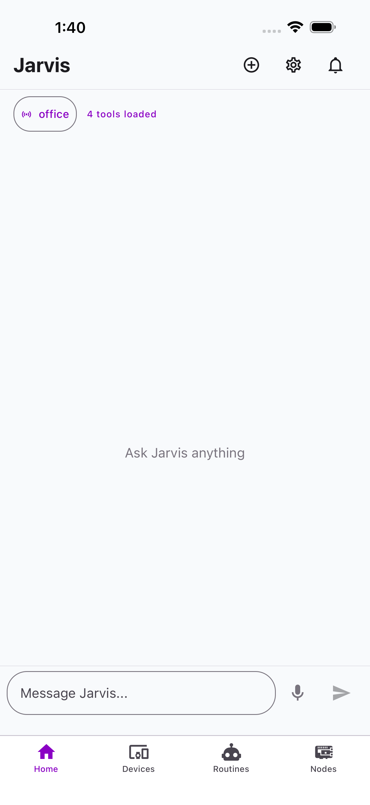
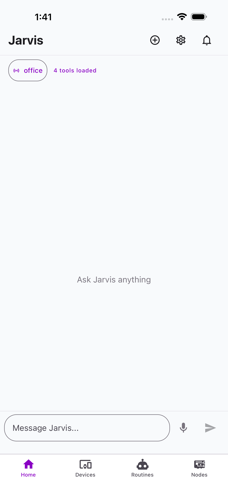
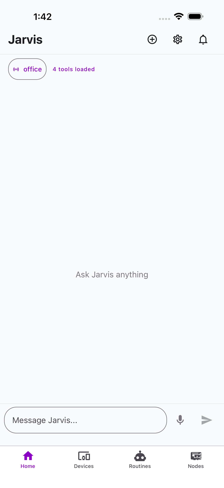
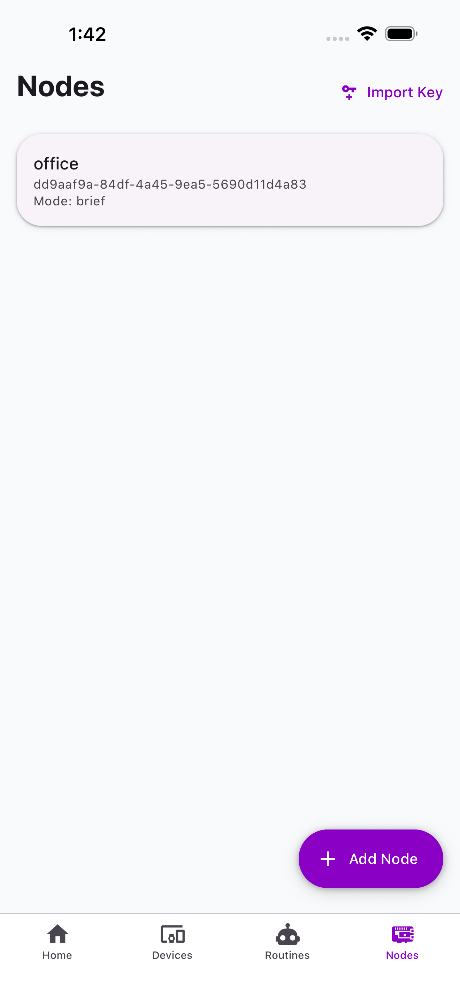
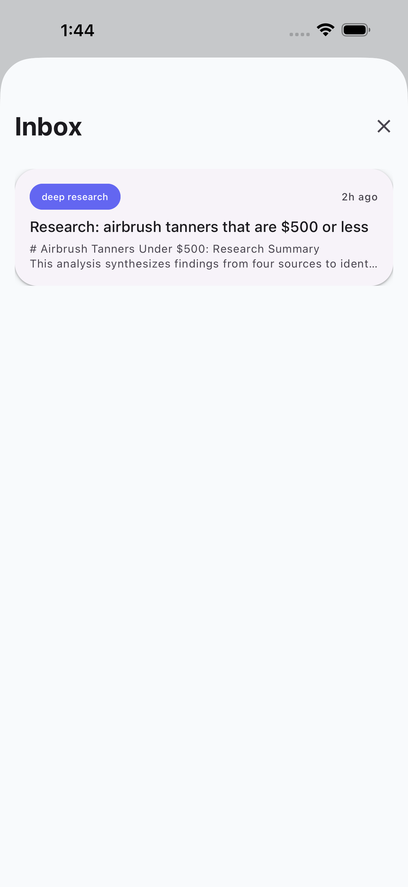
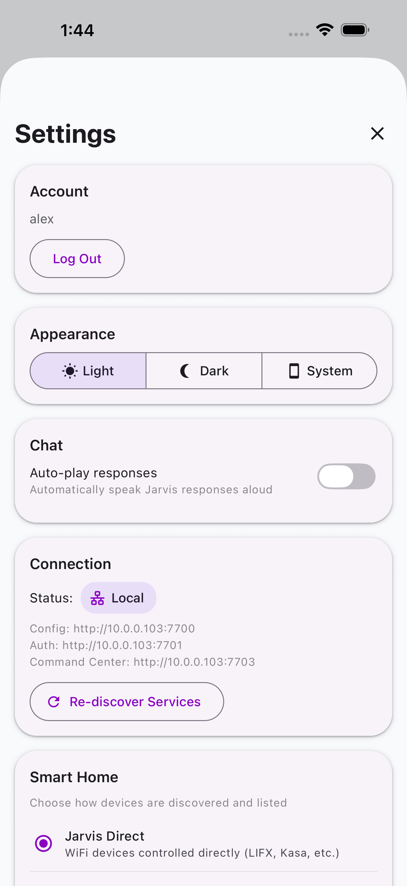

# Mobile App (jarvis-node-mobile)

The Jarvis mobile app is built with Expo/React Native and runs on iOS and Android. It serves as the companion app for managing Pi Zero nodes, receiving notifications, and browsing deep research results.

## Features

- **Node provisioning** -- QR code scanning to pair new Pi Zero nodes and push WiFi credentials
- **Settings sync** -- View and edit node command settings via encrypted snapshots (K2 key)
- **Push notifications** -- Receive alerts from Jarvis services (via `jarvis-notifications`)
- **Inbox** -- Browse deep research results and other long-form content
- **Home Assistant** -- Device discovery and smart home control
- **Node management** -- View paired nodes, rooms, and device status

## Screenshots

<div class="screenshot-grid" markdown>

<figure markdown>
  { width="280" loading=lazy }
  <figcaption>Home — chat interface with voice and text input</figcaption>
</figure>

<figure markdown>
  { width="280" loading=lazy }
  <figcaption>Devices — smart home control by room</figcaption>
</figure>

<figure markdown>
  { width="280" loading=lazy }
  <figcaption>Routines — on-demand and scheduled automations</figcaption>
</figure>

<figure markdown>
  { width="280" loading=lazy }
  <figcaption>Nodes — paired Pi Zero devices</figcaption>
</figure>

<figure markdown>
  { width="280" loading=lazy }
  <figcaption>Inbox — deep research results and alerts</figcaption>
</figure>

<figure markdown>
  { width="280" loading=lazy }
  <figcaption>Settings — account, theme, and connection status</figcaption>
</figure>

</div>

## Tech Stack

| Technology | Version | Purpose |
|------------|---------|---------|
| Expo | 54 | Build toolchain and native modules |
| React Native | 0.81 | Cross-platform UI |
| React | 19 | Component framework |
| TypeScript | — | Type safety |
| React Navigation 7 | — | Bottom tabs + native stacks |
| React Native Paper | — | Material Design UI components |
| React Query 5 | — | Server state management |
| expo-camera | — | QR code scanning |
| expo-secure-store | — | Token storage in platform keychain |

## Architecture

```
jarvis-node-mobile/
├── App.tsx                    # Root providers (Auth, Config, Theme, Query)
├── src/
│   ├── auth/                  # AuthContext, token management
│   ├── screens/
│   │   ├── Auth/              # Login, registration
│   │   ├── Home/              # Main dashboard
│   │   ├── Devices/           # Paired device list
│   │   ├── Provisioning/      # Node setup flow
│   │   ├── Rooms/             # Room management
│   │   ├── SmartHome/         # Home Assistant integration
│   │   ├── ImportKey/         # K2 key import
│   │   ├── Inbox/             # Deep research results
│   │   └── Settings/          # App settings
│   ├── navigation/            # Tab layout + stack navigators
│   ├── services/
│   │   ├── configDiscoveryService.ts   # Find config-service on network
│   │   ├── configPushService.ts        # Push config to nodes
│   │   ├── haApiService.ts             # Home Assistant API
│   │   ├── haDiscoveryService.ts       # HA auto-discovery
│   │   ├── oauthService.ts             # OAuth flows for commands
│   │   └── qrImportService.ts          # QR code parsing
│   ├── components/            # Reusable UI components
│   ├── contexts/              # ConfigContext (global config state)
│   ├── hooks/                 # Custom React hooks
│   └── api/                   # API clients
├── modules/
│   └── jarvis-crypto/         # Native encryption module
└── __tests__/                 # Jest test suite
```

## Settings Sync (K2 Encryption)

The mobile app and Pi Zero nodes share a symmetric encryption key called **K2** (AES-256). This key is exchanged during provisioning and used to encrypt settings snapshots in transit.

The flow:

1. User taps a node in the mobile app to view its settings
2. Mobile requests a snapshot via the command center
3. Command center notifies the node via MQTT
4. Node builds a settings snapshot, encrypts it with K2, uploads to command center
5. Mobile polls for the snapshot, decrypts with K2, and displays the settings

For development, generate K2 manually:

```bash
cd jarvis-node-setup
python utils/generate_dev_k2.py
```

Then import the key into the mobile app via the **Import Key** screen (Nodes tab > Import Key > paste the base64url string in the DEV input).

## OAuth Flow Execution

Some commands require OAuth tokens (e.g., email, calendar). The mobile app handles the OAuth authorization flow:

1. Command center identifies that a command needs OAuth
2. Mobile app opens the OAuth provider's authorization URL
3. User grants access in the browser
4. Mobile app captures the redirect and sends the token back to the node's encrypted storage

Tokens never touch the mobile app — the command center handles code exchange and storage. The mobile app only orchestrates the browser-based consent flow.

## Push Notifications

The mobile app registers for push notifications with `jarvis-notifications`:

1. App registers its Expo push token with the notifications service
2. Backend services send notifications (e.g., deep research complete, timer alerts)
3. `jarvis-notifications` forwards to `jarvis-notifications-relay` for Expo Push API delivery
4. User taps the notification to open the relevant screen (e.g., inbox detail)

## Inbox

The Inbox tab displays long-form results from deep research queries and other asynchronous operations. Items are stored in `jarvis-notifications` and fetched via its REST API.

<figure markdown>
  { width="300" loading=lazy }
  <figcaption>Inbox items with category chips (deep research, alert, reminder) and relative timestamps</figcaption>
</figure>

## Development

```bash
# Install dependencies
npm install

# Start Expo dev server
npm start

# Run on iOS Simulator
npm run ios

# Run on Android Emulator
npm run android

# Run tests
npm test
npm run test:coverage
```

API URLs are configured in `src/config/env.ts`. In development mode, the app connects to `localhost`.

## Service Dependencies

| Service | Required | Purpose |
|---------|----------|---------|
| Auth (7701) | Yes | Login, token management |
| Config Service (7700) | Yes | Service discovery |
| Command Center (7703) | No | Node registration, settings sync |
| Notifications (7712) | No | Push notifications, inbox |
