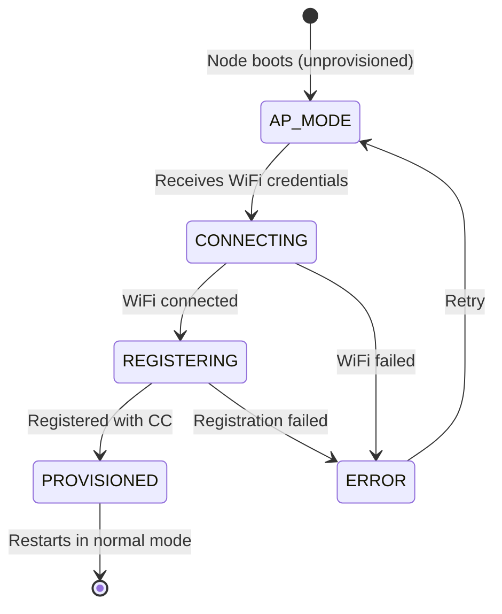

# Headless Provisioning

Pi Zero nodes run headless (no screen, no keyboard). The provisioning system allows the mobile app to bootstrap a fresh node over WiFi -- configuring network credentials, exchanging encryption keys, and registering with the command center.

## How It Works

When `main.py` starts on an unprovisioned node, it automatically enters provisioning mode:

1. **AP mode** -- The node creates a WiFi access point named `jarvis-XXXX` (where XXXX is derived from the device MAC address).
2. **Provisioning API** -- A lightweight FastAPI server starts on port 8080.
3. **Mobile app connects** -- The user connects their phone to the `jarvis-XXXX` network and opens the Jarvis mobile app.
4. **K2 exchange** -- The mobile app sends a shared encryption key (K2) for future settings sync.
5. **WiFi + registration** -- The mobile app sends home WiFi credentials and the command center URL. The node connects to WiFi, registers with the command center, and transitions to normal operation.

No manual SSH, no config files, no typing on the Pi.

## State Machine



| State | Description |
|-------|-------------|
| `AP_MODE` | Access point active, waiting for mobile app |
| `CONNECTING` | Attempting to connect to the home WiFi network |
| `REGISTERING` | Connected to WiFi, registering with the command center |
| `PROVISIONED` | Registration complete, ready for normal operation |
| `ERROR` | Something went wrong (WiFi failed, registration failed) |

## API Endpoints

The provisioning server runs on port 8080 and exposes:

| Endpoint | Method | Description |
|----------|--------|-------------|
| `/api/v1/info` | GET | Node info: id, firmware version, MAC address, capabilities, current state |
| `/api/v1/scan-networks` | GET | List available WiFi networks with signal strength |
| `/api/v1/provision/k2` | POST | Send the K2 encryption key for settings sync |
| `/api/v1/provision` | POST | Send WiFi credentials, room name, and command center URL |
| `/api/v1/status` | GET | Current provisioning state and progress |

## K2 Key Exchange

K2 is a shared AES-256 symmetric key used to encrypt settings snapshots between the node and the mobile app. During provisioning:

1. Mobile app generates K2
2. Sends K2 to the node via `POST /api/v1/provision/k2`
3. Node encrypts K2 with its master key (K1) and stores it locally
4. Both sides now share K2 for future encrypted communication

## Created Files

After successful provisioning, these files exist in `~/.jarvis/` on the node:

| File | Description |
|------|-------------|
| `secrets.key` | K1 master key (Fernet). Created on first boot, used to encrypt other secrets. |
| `k2.enc` | K2 settings key, encrypted with K1 |
| `k2_metadata.json` | K2 key ID and creation timestamp |
| `wifi_credentials.enc` | WiFi SSID and password, encrypted with K1 |
| `.provisioned` | Marker file indicating provisioning is complete |

## File Structure

```
provisioning/
├── api.py              # FastAPI endpoints
├── models.py           # Pydantic request/response models
├── registration.py     # Command center registration logic
├── startup.py          # Provisioning detection (check .provisioned marker)
├── state_machine.py    # State management
├── wifi_credentials.py # Encrypted credential storage
└── wifi_manager.py     # WiFi operations (AP mode, connect, scan)
```

## Development

For development on macOS or Ubuntu (without real WiFi hardware), use simulation mode:

```bash
cd jarvis-node-setup

# Simulated WiFi manager (no real AP mode)
JARVIS_SIMULATE_PROVISIONING=true python scripts/run_provisioning.py

# Real WiFi (on Pi Zero with NetworkManager)
sudo python scripts/run_provisioning.py
```

### Environment Variables

| Variable | Default | Description |
|----------|---------|-------------|
| `JARVIS_SIMULATE_PROVISIONING` | `false` | Use simulated WiFi manager for development |
| `JARVIS_PROVISIONING_PORT` | `8080` | Port for the provisioning API server |
| `JARVIS_SKIP_PROVISIONING_CHECK` | `false` | Skip provisioning check when `main.py` starts |
| `JARVIS_WIFI_BACKEND` | `networkmanager` | WiFi backend: `networkmanager` or `hostapd` |
