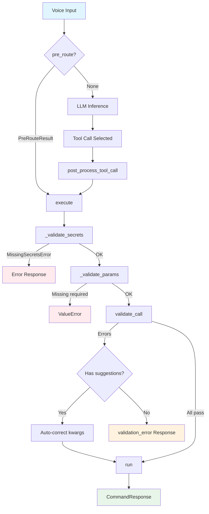
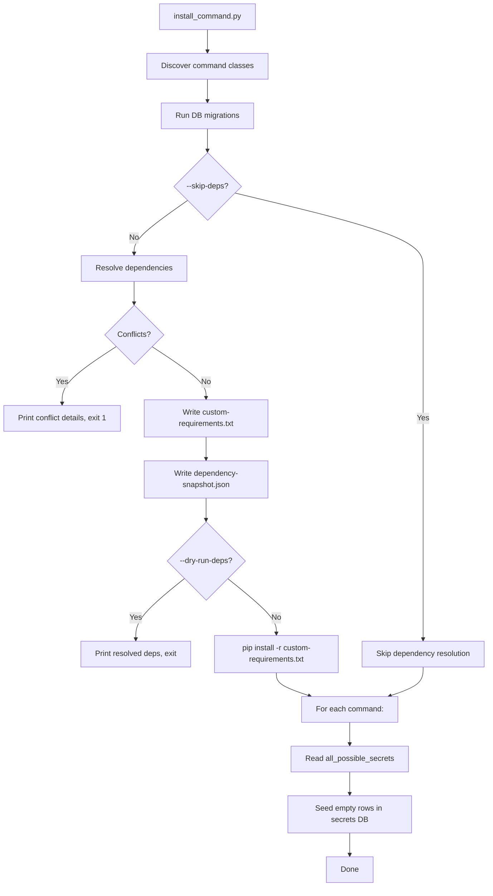
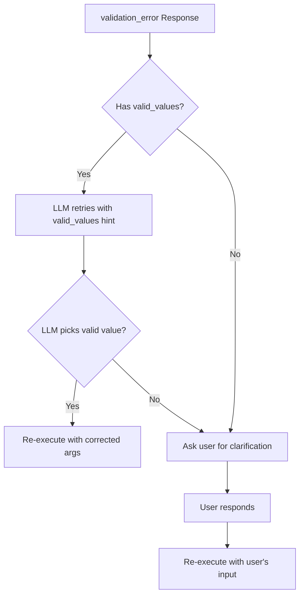
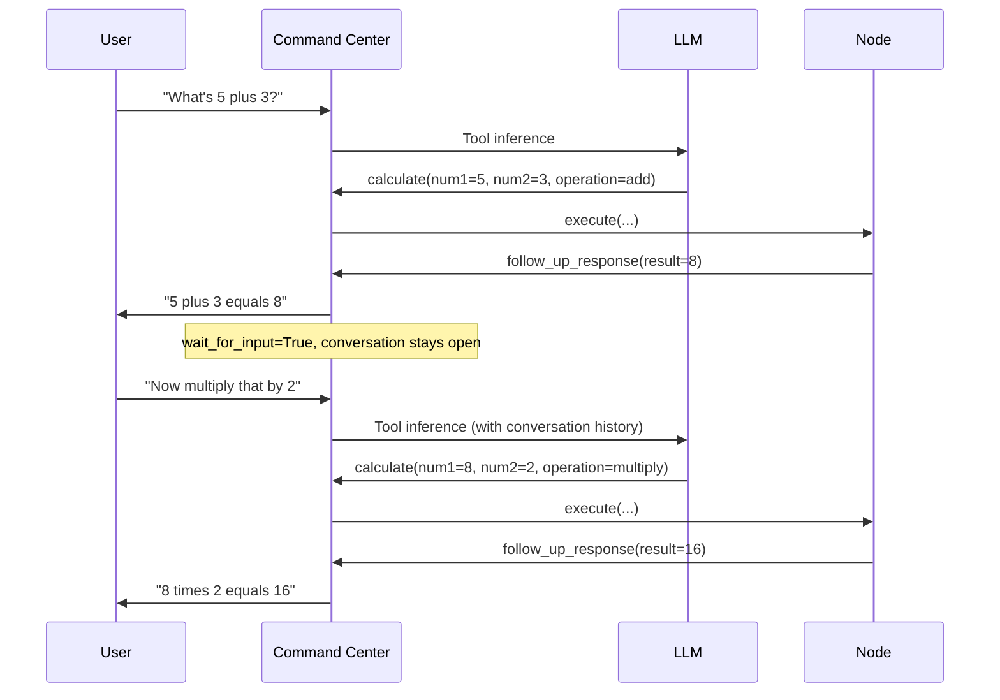

# Execution Lifecycle

This page documents the complete flow from voice input to command response, including every hook and validation step.

## Full Lifecycle Diagram



## Step-by-Step Walkthrough

### 1. Pre-Route Check

Before involving the LLM at all, the command center calls `pre_route()` on every registered command with the raw voice text.

```python
def pre_route(self, voice_command: str) -> PreRouteResult | None:
    text = voice_command.lower().strip()
    if text in ("pause", "pause the music"):
        return PreRouteResult(arguments={"action": "pause"})
    return None
```

**If any command returns a `PreRouteResult`:**

- The LLM is bypassed entirely
- The result's `arguments` dict is passed directly to `execute()`
- If `spoken_response` is set, it overrides the normal TTS generation
- This is significantly faster (no LLM latency)

**If all commands return `None`:**

- Normal LLM inference proceeds

**When to use pre_route:**

- Short, unambiguous commands ("pause", "skip", "resume", "volume 50")
- Deterministic patterns that never need LLM interpretation
- Keep the word count check tight (the music command caps at 5 words)

### 2. LLM Inference

The command center sends the voice command to the LLM along with all registered command schemas (generated by `get_command_schema()` or `to_openai_tool_schema()`).

The LLM:

1. Reads all command descriptions, parameters, examples, rules, and antipatterns
2. Selects the best-matching command (or decides to answer directly if `allow_direct_answer=True`)
3. Extracts parameter values from the voice command
4. Returns a tool call with the command name and arguments

### 3. Post-Process Tool Call

After the LLM produces a tool call, `post_process_tool_call()` gets a chance to fix common LLM mistakes before execution.

```python
def post_process_tool_call(self, args: dict, voice_command: str) -> dict:
    # Fix: LLM sometimes passes action="delete" instead of "trash"
    if args.get("action") == "delete":
        args["action"] = "trash"

    # Fix: LLM sometimes forgets the query for play action
    if args.get("action") == "play" and not args.get("query"):
        args["query"] = self._extract_query_from_utterance(voice_command)

    return args
```

This method receives the raw voice command as a second argument, which is useful for extracting data the LLM missed.

### 4. Execute (Orchestration)

`execute()` on `JarvisCommandBase` orchestrates the validation pipeline. You do **not** override this method.

```python
def execute(self, request_info: RequestInformation, **kwargs) -> CommandResponse:
    self._validate_secrets()
    self._validate_params(kwargs)

    results = self.validate_call(**kwargs)
    errors = [r for r in results if not r.success]
    if errors:
        return CommandResponse.validation_error(errors)

    # Apply auto-corrections
    for r in results:
        if r.suggested_value is not None:
            kwargs[r.param_name] = r.suggested_value

    return self.run(request_info, **kwargs)
```

### 5. Secret Validation

`_validate_secrets()` checks that every secret in `required_secrets` with `required=True` has a non-empty value in the database.

```python
def _validate_secrets(self):
    missing = []
    for secret in self.required_secrets:
        if secret.required and not get_secret_value(secret.key, secret.scope):
            missing.append(secret.key)
    if missing:
        raise MissingSecretsError(missing)
```

If secrets are missing, a `MissingSecretsError` is raised. The command center catches this and tells the user to configure the missing settings.

### 6. Parameter Presence Validation

`_validate_params()` checks that every parameter with `required=True` is present in kwargs.

```python
def _validate_params(self, kwargs):
    missing = [
        p.name for p in self.parameters if p.required and kwargs.get(p.name) is None
    ]
    if missing:
        raise ValueError(f"Missing required params: {', '.join(missing)}")
```

### 7. Value Validation

`validate_call()` runs three checks on each parameter value:

1. **Type validation** -- is the value the right Python type?
2. **Enum validation** -- if `enum_values` is set, is the value in the list?
3. **Custom validation** -- if a `validation_function` is defined, does it pass?

The default implementation loops over all parameters:

```python
def validate_call(self, **kwargs) -> list[ValidationResult]:
    results = []
    for param in self.parameters:
        value = kwargs.get(param.name)
        if value is None:
            continue
        is_valid, error_msg = param.validate(value)
        if not is_valid:
            results.append(ValidationResult(
                success=False,
                param_name=param.name,
                command_name=self.command_name,
                message=error_msg,
                valid_values=param.enum_values,
            ))
    return results
```

Override for cross-parameter or context-dependent validation:

```python
def validate_call(self, **kwargs) -> list[ValidationResult]:
    results = super().validate_call(**kwargs)
    # Custom: verify entity_id exists in Home Assistant
    entity_id = kwargs.get("entity_id")
    if entity_id and not self._entity_exists(entity_id):
        results.append(ValidationResult(
            success=False,
            param_name="entity_id",
            command_name=self.command_name,
            message=f"Device '{entity_id}' not found",
            valid_values=self._get_known_entities(),
        ))
    return results
```

### 8. Auto-Correction

If any `ValidationResult` has a `suggested_value`, the value is automatically corrected in kwargs before `run()` is called:

```python
for r in results:
    if r.suggested_value is not None:
        kwargs[r.param_name] = r.suggested_value
```

This is useful for fuzzy matching. For example, if the user says "turn on the living room light" and the entity is `light.living_room_main`, your `validate_call()` can return a suggestion:

```python
results.append(ValidationResult(
    success=True,
    param_name="entity_id",
    command_name=self.command_name,
    suggested_value="light.living_room_main",
))
```

### 9. Run

Finally, your `run()` method executes with validated, potentially auto-corrected parameters:

```python
def run(self, request_info: RequestInformation, **kwargs) -> CommandResponse:
    # Parameters are validated and corrected at this point
    city = kwargs.get("city", "default")
    return CommandResponse.success_response(context_data={"city": city})
```

### 10. Response Back to CC

The `CommandResponse` flows back to the command center, which:

1. Reads `context_data` and generates a spoken response via the LLM
2. Sends TTS audio to the node
3. Sends structured data to the mobile app
4. If `wait_for_input=True`, keeps the conversation open
5. If `actions` are present, renders buttons in the mobile UI

---

## Installation Lifecycle

When a command is first installed on a node, a separate lifecycle runs.

### `install_command.py` Flow



The dependency resolver collects `required_packages` from all commands, merges version constraints, and checks compatibility against `requirements.txt`. If two commands need the same package with incompatible versions, the install fails with a clear error.

```bash
# Install all commands (resolve deps + seed secrets)
python scripts/install_command.py --all

# Install a specific command
python scripts/install_command.py get_weather

# List commands and their secrets
python scripts/install_command.py --list

# Resolve dependencies only, don't install
python scripts/install_command.py --all --dry-run-deps

# Skip dependency resolution
python scripts/install_command.py --all --skip-deps
```

### `init_data.py` Flow

For commands that need first-install setup (like fetching device lists or registering with external services):

```bash
python scripts/init_data.py --command music
```

This calls the command's `init_data()` method, which can run interactive setup:

```python
def init_data(self) -> dict:
    # Interactive setup: prompt for URL, authenticate, list devices
    url = input("Service URL: ")
    # ... setup logic ...
    return {"status": "success", "devices_found": 5}
```

### `required_packages` and Dependency Resolution

When commands declare `required_packages`, the install script resolves all command dependencies together:

```python
@property
def required_packages(self) -> List[JarvisPackage]:
    return [
        JarvisPackage("music-assistant-client", ">=1.3.0"),
    ]
```

The resolver:

1. **Collects** all `required_packages` from enabled commands
2. **Normalizes** package names (PEP 503: lowercase, hyphens)
3. **Checks compatibility** across commands and against `requirements.txt`
4. **Writes** `custom-requirements.txt` (merged pip specs) and `dependency-snapshot.json` (for future command-store compatibility)
5. **Installs** via `pip install -r custom-requirements.txt`

If a command package is already in `requirements.txt` with compatible constraints, base wins (no duplicate entry). If incompatible, the resolver reports which commands and base requirements conflict.

**Vendored packages:** Commands that need a patched or forked pure-Python library can vendor it in `vendor/<command_name>/<package_name>/` and manage `sys.path` themselves. Vendored packages are not subject to dependency resolution.

---

## Validation Flow (CC Side)

When the command center receives a `validation_error` response, it follows this flow:



The `valid_values` list in `ValidationResult` is critical -- it tells the LLM what the correct options are, allowing automatic retry without bothering the user.

---

## Multi-Turn Conversation Flow

When a command returns `wait_for_input=True`, the conversation stays open:



The LLM has access to the conversation history, so it can resolve references like "that" to the previous result.
