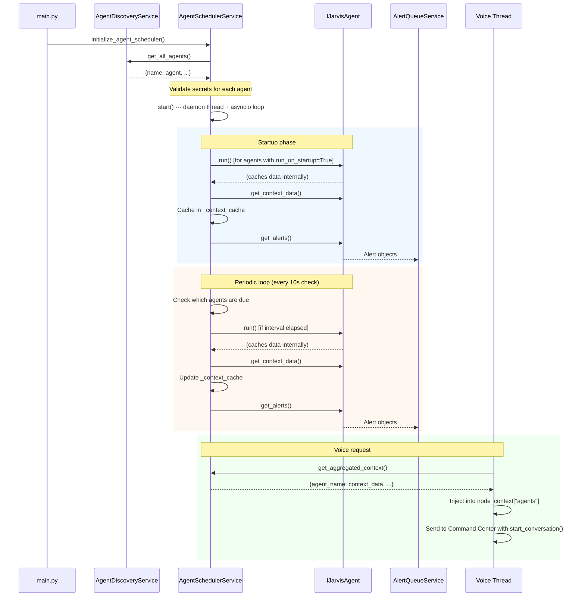

# Agents

> **The Coordinators** --- Agents are the senior staff who work autonomously without being asked. They watch the calendar, monitor the mail, and tap you on the shoulder when something needs your attention --- all before you think to ask.

Agents are **background tasks** that run on a schedule on the node. Unlike [commands](../../commands/index.md) (reactive, triggered by voice), agents are proactive --- they collect data on a timer and either inject it into voice request context or produce alerts.

A command answers the question "what did the user just ask for?" An agent answers the question "what should the system already know?"

## When to Use an Agent

Use an agent when you need to:

- **Pre-fetch data** so voice commands can reference it without blocking on API calls (e.g., Home Assistant device states)
- **Monitor external sources** and surface time-sensitive alerts (e.g., calendar events, breaking news, urgent emails)
- **Perform background maintenance** like refreshing OAuth tokens before they expire

If the task is triggered by a user's voice and returns a direct response, it belongs in a command. If the task runs on a timer and feeds data to other parts of the system, it belongs in an agent.

## The IJarvisAgent Interface

Every agent implements `IJarvisAgent`, defined in `jarvis-node-setup/core/ijarvis_agent.py`:

```python
from abc import ABC, abstractmethod
from dataclasses import dataclass
from typing import Any, Dict, List

from core.alert import Alert
from core.ijarvis_secret import IJarvisSecret


@dataclass
class AgentSchedule:
    interval_seconds: int
    run_on_startup: bool = True


class IJarvisAgent(ABC):
    # --- Abstract (must implement) ---

    @property
    @abstractmethod
    def name(self) -> str:
        """Unique identifier (e.g., 'home_assistant')."""
        ...

    @property
    @abstractmethod
    def description(self) -> str:
        """Human-readable description."""
        ...

    @property
    @abstractmethod
    def schedule(self) -> AgentSchedule:
        """When this agent should run."""
        ...

    @property
    @abstractmethod
    def required_secrets(self) -> List[IJarvisSecret]:
        """Secrets this agent needs to function."""
        ...

    @abstractmethod
    async def run(self) -> None:
        """Fetch data, cache results internally."""
        ...

    @abstractmethod
    def get_context_data(self) -> Dict[str, Any]:
        """Return cached data (must be fast --- just return the cache)."""
        ...

    # --- Optional (with defaults) ---

    @property
    def include_in_context(self) -> bool:
        """Whether to inject this agent's data into voice request context.
        Default: True."""
        return True

    def get_alerts(self) -> List[Alert]:
        """Return alerts from the last run. Default: empty list."""
        return []

    def validate_secrets(self) -> List[str]:
        """Return list of missing secret keys. Default: checks all required_secrets."""
        ...
```

### Method Responsibilities

| Method | Called by | Frequency | Must be fast? |
|--------|----------|-----------|---------------|
| `run()` | Scheduler thread | Every `interval_seconds` | No --- can do network I/O |
| `get_context_data()` | Voice request thread | Every voice request | Yes --- return cached data only |
| `get_alerts()` | Scheduler thread | After each `run()` | Yes --- return pre-built alerts |
| `validate_secrets()` | Discovery service | Once at startup | Yes |

## Agent Patterns

There are three common patterns for agents, distinguished by what they produce.

### 1. Context Agents

Context agents set `include_in_context=True` (the default) and populate `get_context_data()` with data that gets injected into every voice request's system prompt.

**Example: HomeAssistantAgent**

- **Schedule:** Every 300 seconds (5 minutes), runs on startup
- **`run()`:** Fetches device states, areas, and floors from the Home Assistant API
- **`get_context_data()`:** Returns cached device lists grouped by domain (lights, switches, locks, climate, etc.) and floor/area mappings
- **Effect:** When a user says "turn off the kitchen lights," the LLM already knows which `entity_id` corresponds to the kitchen lights because it was pre-fetched

### 2. Alert Agents

Alert agents set `include_in_context=False` and produce `Alert` objects via `get_alerts()`. They do not inject data into the system prompt --- instead, they push time-sensitive notifications into the `AlertQueueService`.

**Example: CalendarAlertAgent**

- **Schedule:** Every 300 seconds (5 minutes)
- **`run()`:** Checks upcoming calendar events, generates alerts for events starting within the next 15 minutes
- **`get_context_data()`:** Returns empty dict (not used for context)
- **`get_alerts()`:** Returns `Alert` objects with priority 3 (high) for imminent events

**Example: NewsAlertAgent**

- **Schedule:** Every 1800 seconds (30 minutes)
- **`run()`:** Polls RSS feeds for breaking news matching user-defined keywords
- **`get_alerts()`:** Returns `Alert` objects with priority 2 (medium), TTL of 2 hours

**Example: EmailAlertAgent**

- **Schedule:** Every 300 seconds (5 minutes)
- **`run()`:** Checks for emails from VIP senders or with urgent flags
- **`get_alerts()`:** Returns `Alert` objects with priority based on sender/flag importance

### 3. Infrastructure Agents

Infrastructure agents produce neither context nor alerts. They exist purely for side effects --- background maintenance tasks that keep the system running smoothly.

**Example: TokenRefreshAgent**

- **Schedule:** Every 3300 seconds (55 minutes), runs on startup
- **`include_in_context`:** `False`
- **`run()`:** Checks OAuth token expiry times and refreshes tokens that are within 10 minutes of expiring
- **`get_context_data()`:** Returns empty dict
- **`get_alerts()`:** Returns empty list (default)

## Lifecycle



## How Context Flows

1. **Agent runs:** `agent.run()` fetches data from external APIs and caches it internally
2. **Scheduler caches:** After each run, the scheduler calls `agent.get_context_data()` and stores the result in `_context_cache[agent.name]`
3. **Voice request:** When a voice request arrives, the main thread calls `scheduler.get_aggregated_context()` to get a thread-safe snapshot of all agent data
4. **Node context:** The aggregated context is placed into `node_context["agents"]` and sent to the Command Center with `start_conversation()`
5. **System prompt:** The Command Center's prompt provider reads `node_context["agents"]` and includes relevant data in the LLM's system prompt (e.g., `build_agent_context_summary()` for Home Assistant devices)

## Tutorial: Building a System Monitor Agent

This tutorial walks through building a simple agent that reports CPU and memory usage. It is a context agent --- the data is injected into voice requests so the LLM can answer questions like "how's my system doing?"

### Step 1: Create the Agent File

Create `jarvis-node-setup/agents/system_monitor_agent.py`:

```python
import psutil
from typing import Any, Dict, List

from core.alert import Alert
from core.ijarvis_agent import AgentSchedule, IJarvisAgent
from core.ijarvis_secret import IJarvisSecret


class SystemMonitorAgent(IJarvisAgent):
    """Background agent that monitors CPU and memory usage."""

    def __init__(self) -> None:
        self._cached_data: Dict[str, Any] = {}
        self._alerts: List[Alert] = []

    @property
    def name(self) -> str:
        return "system_monitor"

    @property
    def description(self) -> str:
        return "Monitors CPU and memory usage for voice queries"

    @property
    def schedule(self) -> AgentSchedule:
        return AgentSchedule(interval_seconds=60, run_on_startup=True)

    @property
    def required_secrets(self) -> List[IJarvisSecret]:
        return []  # No secrets needed --- reads local system stats

    async def run(self) -> None:
        """Fetch current CPU and memory stats."""
        cpu_percent: float = psutil.cpu_percent(interval=1)
        memory = psutil.virtual_memory()

        self._cached_data = {
            "cpu_percent": cpu_percent,
            "memory_used_gb": round(memory.used / (1024 ** 3), 1),
            "memory_total_gb": round(memory.total / (1024 ** 3), 1),
            "memory_percent": memory.percent,
        }

        # Generate alert if memory usage is critical
        self._alerts = []
        if memory.percent > 90:
            from datetime import datetime, timedelta, timezone

            self._alerts.append(Alert(
                source_agent=self.name,
                title="High memory usage",
                summary=f"Memory at {memory.percent}% ({self._cached_data['memory_used_gb']}GB / {self._cached_data['memory_total_gb']}GB)",
                created_at=datetime.now(timezone.utc),
                expires_at=datetime.now(timezone.utc) + timedelta(minutes=10),
                priority=3,
            ))

    def get_context_data(self) -> Dict[str, Any]:
        """Return cached system stats."""
        return self._cached_data

    def get_alerts(self) -> List[Alert]:
        """Return memory alerts if any."""
        return self._alerts
```

### Step 2: That's It

Drop the file in `jarvis-node-setup/agents/` and restart the node. The `AgentDiscoveryService` will find it automatically, the `AgentSchedulerService` will start running it on the configured schedule, and the data will be available in voice requests.

### Step 3: Verify

After the node starts, you can check the agent status via the scheduler:

```python
from services.agent_scheduler_service import get_agent_scheduler_service

scheduler = get_agent_scheduler_service()
status = scheduler.get_agent_status()
print(status["system_monitor"])
# {
#     "name": "system_monitor",
#     "description": "Monitors CPU and memory usage for voice queries",
#     "interval_seconds": 60,
#     "last_run": "2026-03-17T12:00:00+00:00",
#     "next_run": "2026-03-17T12:01:00+00:00",
#     "include_in_context": True,
# }
```

The LLM will now see system stats in its context and can answer questions like "what's my CPU usage?" or "how much memory is free?" without needing a dedicated command.

### Design Notes

- **`run()` is async:** Even though `psutil.cpu_percent(interval=1)` blocks for 1 second, this is acceptable because the scheduler runs agents in a dedicated asyncio event loop on a daemon thread. For longer blocking calls, use `asyncio.to_thread()`.
- **Alerts are optional:** This agent produces both context data and alerts. If you only want context, skip the `get_alerts()` override entirely (the default returns an empty list).
- **No secrets needed:** Not every agent needs API keys. The `required_secrets` list can be empty.
- **Error handling:** If `run()` raises an exception, the scheduler catches it, caches an error state in the context (`{"last_error": "...", "error_time": "..."}`), and continues running other agents. The scheduler never crashes from a single agent failure.

## Source Files

| File | Description |
|------|-------------|
| `jarvis-node-setup/core/ijarvis_agent.py` | `IJarvisAgent` ABC and `AgentSchedule` dataclass |
| `jarvis-node-setup/core/alert.py` | `Alert` dataclass |
| `jarvis-node-setup/services/agent_scheduler_service.py` | `AgentSchedulerService` (scheduling, context aggregation) |
| `jarvis-node-setup/services/alert_queue_service.py` | `AlertQueueService` (thread-safe alert queue) |
| `jarvis-node-setup/agents/` | Directory for agent implementations |
