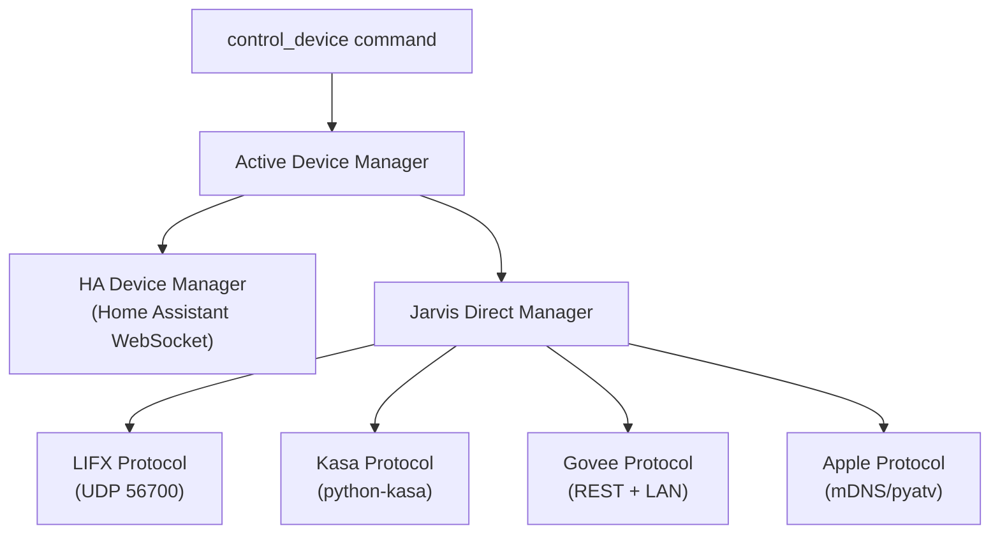

# Device Control

Jarvis uses a two-tier architecture for smart home device control:

1. **Device Managers** / The Stewards (`IJarvisDeviceManager`) --- high-level backends that maintain the master device inventory. A steward might consult Home Assistant (an external authority) or aggregate several translators directly.
2. **Device Protocols** / The Translators (`IJarvisDeviceProtocol`) --- low-level protocol adapters that speak each device family's native language over LAN or cloud APIs (LIFX bulbs, Kasa switches, Govee lights, Apple TV).

The `control_device` command does not care which tier handles a device. It asks the active device manager for a device list, matches the user's intent, and delegates control.

## Architecture



## Managers vs Protocols

| Aspect | Device Manager | Device Protocol |
|--------|---------------|----------------|
| Interface | `IJarvisDeviceManager` | `IJarvisDeviceProtocol` |
| Package | `device_managers/` | `device_families/` |
| Scope | Aggregates many devices (possibly many protocols) | Controls one protocol/device family |
| Discovery | `DeviceManagerDiscoveryService` | `DeviceFamilyDiscoveryService` |
| Example | Home Assistant (hundreds of entities), Jarvis Direct (aggregates all protocols) | LIFX (UDP LAN bulbs), Kasa (TP-Link switches) |

**When to write a Device Manager:** You have a platform that already aggregates devices (like Home Assistant, SmartThings, or a proprietary hub) and you want Jarvis to pull its device list.

**When to write a Device Protocol:** You want to control a specific device family directly over LAN or cloud API, without an intermediary platform.

## The Normalized Device Format

Both tiers produce a common `DeviceManagerDevice` dataclass so the rest of the system does not need to know where a device came from:

```python
@dataclass
class DeviceManagerDevice:
    name: str               # Human-readable name ("Living Room Light")
    domain: str             # HA-style domain ("light", "switch", "climate", "media_player")
    entity_id: str          # Unique ID ("light.living_room")
    is_controllable: bool   # Can Jarvis send commands to this device?
    manufacturer: str       # "LIFX", "TP-Link", "Govee"
    model: str              # "A19", "KP125", "H6061"
    protocol: str           # "lifx", "kasa", "govee", "homeassistant"
    local_ip: str | None    # LAN IP if available
    mac_address: str | None # MAC address if available
    cloud_id: str | None    # Cloud/vendor device ID
    area: str | None        # Room or area ("living_room", "kitchen")
    state: str | None       # Current state ("on", "off", "72F")
    extra: dict | None      # Protocol-specific metadata
```

This format is used for:

- Device list display in the mobile app
- Command matching (the LLM sees device names and domains)
- Settings sync snapshots (`get_all_managers_for_snapshot()`)

## Getting Started

- To integrate a platform that already has device lists, see [Device Managers](managers.md).
- To add direct control for a new protocol or device family, see [Device Protocols](protocols.md).
- For how plugins are found at runtime, see the [Discovery System](../discovery.md).
