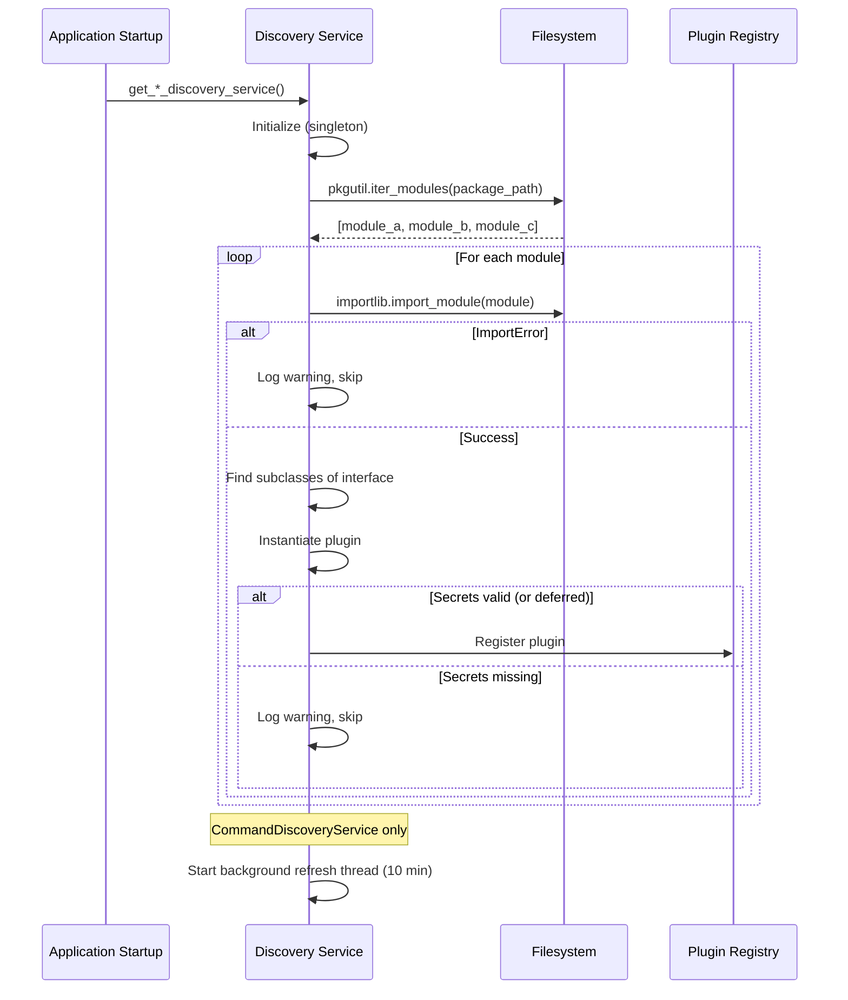

# The Discovery System

Jarvis automatically finds and loads plugins at runtime using Python's reflection capabilities. Every discovery service follows the same core algorithm: scan a package directory, find classes that implement a target interface, instantiate them, and register them.

This page explains how that works in detail, including the differences between each discovery service.

## The Universal Discovery Algorithm

All discovery services use a variation of this pattern:

```python
import pkgutil
import importlib
import inspect

def discover(package, base_interface):
    """Scan a package for classes implementing base_interface."""
    plugins = {}

    for importer, module_name, is_pkg in pkgutil.iter_modules(package.__path__):
        try:
            module = importlib.import_module(f"{package.__name__}.{module_name}")
        except ImportError as e:
            logger.warning(f"Skipping {module_name}: {e}")
            continue

        for attr_name in dir(module):
            attr = getattr(module, attr_name)

            if not inspect.isclass(attr):
                continue
            if not issubclass(attr, base_interface):
                continue
            if attr is base_interface:
                continue  # skip the interface itself

            try:
                instance = attr()

                # Validate secrets if applicable
                if hasattr(instance, 'validate_secrets'):
                    if not instance.validate_secrets():
                        logger.warning(f"Skipping {instance.name}: missing secrets")
                        continue

                plugins[instance.name] = instance
            except Exception as e:
                logger.error(f"Failed to instantiate {attr_name}: {e}")

    return plugins
```

The key ingredients from the Python standard library:

- **`pkgutil.iter_modules()`** --- iterates over all modules in a package directory without importing them
- **`importlib.import_module()`** --- dynamically imports a module by name
- **`issubclass()`** --- checks if a class implements the target interface
- **`inspect.isclass()`** --- filters out non-class attributes

This combination means you never need to register a plugin. Place a `.py` file containing a class that subclasses the right interface, and the system finds it.

## Discovery Services

Each extension point has its own discovery service. They all follow the universal algorithm above, but differ in when they scan, how they validate, and whether they refresh.

| Service | Scans | Interface | Secret Validation | Background Refresh |
|---------|-------|-----------|-------------------|--------------------|
| `CommandDiscoveryService` | `commands/` | `IJarvisCommand` | At execution time | No — refreshed on demand (install/uninstall/config push call `refresh_now()`) |
| `AgentDiscoveryService` | `agents/` | `IJarvisAgent` | At discovery (skip if missing) | No (once at startup) |
| `DeviceManagerDiscoveryService` | `device_managers/` | `IJarvisDeviceManager` | At discovery (skip if missing) | No (once at startup) |
| `DeviceFamilyDiscoveryService` | `device_families/` | `IJarvisDeviceProtocol` | At discovery (skip if missing) | No (once at startup) |
| `PromptProviderFactory` | `app/core/prompt_providers/` | `IJarvisPromptProvider` | N/A | No (on-demand) |

## CommandDiscoveryService

`CommandDiscoveryService` is the most full-featured discovery service. It handles the core command plugins that define what Jarvis can do.

### On-Demand Refresh

`CommandDiscoveryService` does **not** poll in the background. Discovery runs on demand: the command execution service forces an initial scan at startup, and every path that changes what's on disk — Pantry install/uninstall, test installs, config pushes, settings snapshots — calls `refresh_now()` explicitly. (An earlier 10-minute polling thread was removed: it re-imported every custom command module each cycle and leaked memory, and it was redundant with the install-driven refresh path.)

```python
class CommandDiscoveryService:
    def __init__(self):
        self._commands_cache: dict[str, IJarvisCommand] = {}
        self._failed_modules: dict[str, str] = {}
        self._lock = threading.Lock()

    def refresh_now(self):
        """Force an immediate re-scan of the commands directory."""
        self._discover_commands()
```

### CommandRegistry Filtering

`CommandDiscoveryService` integrates with the `CommandRegistry` database table. Even if a command plugin is discovered on disk, it is only active if it is enabled in the registry. This allows administrators to disable commands without deleting files:

```
Disk scan → Found: [get_weather, calculate, get_sports_scores]
Registry  → Enabled: [get_weather, calculate]
Result    → Active: [get_weather, calculate]
```

### Deferred Secret Validation

Commands do not have their secrets validated at discovery time. Instead, validation happens at execution time. This means a command with missing secrets still appears in the registry (as disabled/unavailable) rather than being silently dropped. Users can see what commands exist and what secrets they need to configure.

## AgentDiscoveryService

`AgentDiscoveryService` scans the `agents/` package for classes implementing `IJarvisAgent`. Agents are higher-level orchestrators that can coordinate multiple commands and maintain conversational context.

Discovery happens once at startup. Secret validation occurs immediately --- agents with missing secrets are skipped and logged:

```python
# Agent discovery validates secrets eagerly
instance = agent_class()
if not instance.validate_secrets():
    logger.warning(
        f"Agent '{instance.name}' skipped: "
        f"missing secrets {instance.required_secrets}"
    )
    continue
```

There is no background refresh for agents. If you add a new agent file, restart the node to pick it up.

## DeviceManagerDiscoveryService

`DeviceManagerDiscoveryService` scans `device_managers/` for classes implementing `IJarvisDeviceManager`. Device managers are cloud API integrations for smart home devices (e.g., Govee, Nest).

Like agents, discovery runs once at startup with eager secret validation:

```python
instance = manager_class()
if not instance.validate_secrets():
    logger.warning(
        f"Device manager '{instance.name}' skipped: "
        f"missing secrets {instance.required_secrets}"
    )
    continue
```

## DeviceFamilyDiscoveryService

`DeviceFamilyDiscoveryService` scans `device_families/` for classes implementing the `IJarvisDeviceProtocol`. Device families represent local protocol integrations (WiFi-direct, Bluetooth, etc.) as opposed to the cloud-based device managers.

The pattern is identical to `DeviceManagerDiscoveryService` --- single scan at startup with eager secret validation and no background refresh.

## PromptProviderFactory

`PromptProviderFactory` runs on the Command Center (not the node) and discovers prompt provider classes that control how LLM prompts are formatted for different models.

### Recursive Scanning

Unlike the node-side services that use `pkgutil.iter_modules` (single level), `PromptProviderFactory` uses `pkgutil.walk_packages` to scan recursively. This supports organizing prompt providers into subdirectories:

```
app/core/prompt_providers/
    __init__.py
    base.py                    # IJarvisPromptProvider ABC
    qwen25_medium.py           # top-level provider
    experimental/
        __init__.py
        qwen3_large.py         # nested provider, still discovered
```

### Name-Based Matching

Prompt providers are selected by matching their `name` property (case-insensitive) against a database setting (`llm.interface`). The factory does not instantiate all providers up front --- it scans on demand when a provider is requested, checking the built-in `prompt_providers/` root first and then the `prompt_providers_custom/` volume:

```python
class PromptProviderFactory:
    @classmethod
    def create_provider(cls, provider_name: str | None = None) -> IJarvisPromptProvider | None:
        """Find and instantiate the provider matching the given name.

        Scans both provider roots (built-in prompt_providers/ first, then
        prompt_providers_custom/); first match wins. Returns None if no
        provider matches — the caller falls back to ModelFactory.
        """
        provider = cls._scan_prompt_providers(provider_name)
        return provider  # None when not found
```

Matching is case-insensitive (names are compared upper-cased), and a provider class that fails to import or instantiate is skipped with a debug log rather than crashing the scan.

### No Secret Validation

Prompt providers do not have secrets --- they only format text. There is no `required_secrets` or `validate_secrets` step.

## Graceful Failure

A critical design principle across all discovery services: **a broken plugin never crashes the system**.

Every discovery service wraps module imports in try/except blocks. The most common failure mode is `ImportError` from missing pip packages:

```python
try:
    module = importlib.import_module(f"commands.{module_name}")
except ImportError as e:
    # Plugin requires a package not installed --- skip it
    logger.warning(f"Could not load {module_name}: {e}")
    continue
except Exception as e:
    # Unexpected error --- still skip, don't crash
    logger.error(f"Error loading {module_name}: {e}")
    continue
```

This enables optional dependencies. For example, the `get_sports_scores` command might require the `espn-api` package. On nodes where that package is not installed, the command is silently skipped while all other commands work normally.

Instantiation failures are also caught. If a plugin's `__init__` raises an exception, that plugin is skipped and logged.

## Thread Safety

Discovery services use a `threading.Lock` to protect the plugin registry:

```python
class CommandDiscoveryService:
    def __init__(self):
        self._lock = threading.Lock()
        self._commands_cache: dict[str, IJarvisCommand] = {}

    def get_command(self, name: str) -> IJarvisCommand | None:
        with self._lock:
            return self._commands_cache.get(name)
```

A refresh builds the entire new registry in a local variable, then swaps it in under the lock. This minimizes the time the lock is held and ensures readers never see a partially-built registry.

## Singleton Pattern

Each discovery service is accessed through a module-level singleton accessor:

```python
_discovery_service: CommandDiscoveryService | None = None
_service_lock = threading.Lock()

def get_command_discovery_service() -> CommandDiscoveryService:
    global _discovery_service
    if _discovery_service is None:
        with _service_lock:
            if _discovery_service is None:  # double-checked locking
                _discovery_service = CommandDiscoveryService()
    return _discovery_service
```

This ensures:

- Only one instance exists per process
- Initialization happens lazily (on first access)
- Thread-safe via double-checked locking

The first consumer (the command execution service) triggers the initial scan by calling `refresh_now()`.

The same pattern applies to `get_agent_discovery_service()`, `get_device_manager_discovery_service()`, and `get_device_family_discovery_service()`.

## Forcing a Refresh

To manually trigger a re-scan without waiting for the background timer:

```python
from utils.command_discovery_service import get_command_discovery_service

service = get_command_discovery_service()
service.refresh_now()   # synchronous re-scan
```

This is useful during development when you are iterating on a plugin and want to pick up changes immediately.

## Discovery Lifecycle Summary



## Adding a New Discovery Service

If you are creating a new extension point, follow this checklist:

1. **Define the ABC** --- Create an abstract base class with the required interface methods
2. **Create the package** --- Add a directory with an `__init__.py` that imports the ABC
3. **Write the discovery service** --- Follow the universal algorithm pattern above
4. **Add thread safety** --- Use `RLock` to protect the registry
5. **Add a singleton accessor** --- `get_*_discovery_service()` with double-checked locking
6. **Handle failures gracefully** --- Catch `ImportError` and instantiation errors
7. **Decide on refresh strategy** --- One-time at startup, or background refresh for hot-reloading
