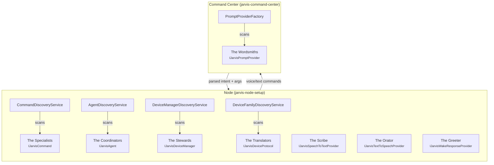

# Extending Jarvis

Jarvis uses a **plugin architecture** built on abstract Python interfaces (ABCs). Every extension point follows the same pattern:

1. **Implement** an abstract interface (e.g., `IJarvisCommand`, `IJarvisAgent`)
2. **Place** the file in the corresponding package directory
3. **Done** --- the discovery system finds it automatically via Python reflection

There is no registration step, no config file to edit, no decorator to apply. Drop a Python file in the right directory and it is live.

## The Household Staff

Think of Jarvis as a well-run household. Each interface represents a role on the staff, and together they cover everything from hearing a request to flipping a light switch. Understanding which role you are filling makes it easier to know what to implement and where to put it.

### The Specialists --- `IJarvisCommand`

Commands are the specialists on staff --- the chef, the accountant, the gardener. Each one knows how to do exactly one thing well. When someone says "What's the weather?", the weather specialist steps forward, does the work, and reports back. You will write more commands than any other plugin type.

**Example:** A weather command fetches a forecast. A calculator command does math. A music command controls playback. Each is self-contained and focused.

### The Coordinators --- `IJarvisAgent`

Agents are the senior staff who work autonomously in the background. While commands respond to direct requests, agents watch for conditions and act on their own --- monitoring an inbox for urgent emails, checking if a package has shipped, or alerting you when a flight is delayed. They coordinate across services without being asked.

**Example:** An email alert agent periodically checks for high-priority messages and pushes a notification. A token refresh agent silently renews OAuth credentials before they expire.

### The Stewards --- `IJarvisDeviceManager`

Device managers are the head stewards who know every room and every device in the house. They maintain the master inventory --- which lights exist, which locks are installed, which thermostats are online. A steward might get that inventory from Home Assistant (an external authority) or by dispatching the household staff to survey each room directly.

**Example:** The Home Assistant manager connects to an HA instance and imports its full entity list. The Jarvis Direct manager aggregates all protocol adapters into one unified device inventory.

### The Translators --- `IJarvisDeviceProtocol`

Device protocols are the translators who speak each device's native language. One translator knows how to talk to LIFX bulbs over UDP. Another knows the Govee cloud API. Another speaks the Kasa local protocol. The steward (device manager) dispatches translators to discover and control devices, but the translator handles the actual conversation with hardware.

**Example:** The LIFX protocol broadcasts on UDP port 56700 to find bulbs and send brightness commands. The Govee protocol talks to both a local LAN endpoint and a cloud REST API.

### The Scribe --- `IJarvisSpeechToTextProvider`

The scribe listens and transcribes. When someone speaks, the scribe converts audio into text that the rest of the household can act on. Different scribes use different tools --- one might use a local Whisper model, another might call a cloud API --- but they all produce the same clean transcript.

### The Orator --- `IJarvisTextToSpeechProvider`

The orator is the household's voice. When Jarvis needs to speak a response aloud, the orator converts text into natural speech. Like the scribe, different orators use different engines (Piper, Kokoro, or a cloud TTS API), but they all produce audio from text. The server-side engine is swappable via the `tts.provider` setting — see the [TTS service docs](../services/tts.md).

### The Greeter --- `IJarvisWakeResponseProvider`

The greeter handles the first moment of interaction --- the acknowledgment when someone says the wake word. A quick "Yes?", a chime, or a contextual greeting ("Good morning, Alex"). The greeter sets the tone before the real work begins.

### The Wordsmith --- `IJarvisPromptProvider`

The wordsmith runs on the command center, not the node. They craft the system prompts that shape how the LLM interprets voice commands --- choosing the right framing, formatting tool schemas, and tuning the prompt for the specific model being used. Different wordsmiths optimize for different LLMs.

## Extension Points

| Extension Point | Interface | Role | Package Directory | Runs On | Discovery |
|----------------|-----------|------|-------------------|---------|-----------|
| [Commands](../commands/index.md) | `IJarvisCommand` | The Specialists | `commands/` | Node | `CommandDiscoveryService` |
| [Agents](agents/index.md) | `IJarvisAgent` | The Coordinators | `agents/` | Node | `AgentDiscoveryService` |
| [Device Managers](devices/managers.md) | `IJarvisDeviceManager` | The Stewards | `device_managers/` | Node | `DeviceManagerDiscoveryService` |
| [Device Protocols](devices/protocols.md) | `IJarvisDeviceProtocol` | The Translators | `device_families/` | Node | `DeviceFamilyDiscoveryService` |
| Routines | JSON definitions | The Playbooks | `routines/` | Node | Loaded by `RoutineCommand` |
| [Prompt Providers](prompt-providers/index.md) | `IJarvisPromptProvider` | The Wordsmiths | `app/core/prompt_providers/` | Command Center | `PromptProviderFactory` |
| STT Providers | `IJarvisSpeechToTextProvider` | The Scribe | `stt_providers/` | Node | Manual config |
| TTS Providers | `IJarvisTextToSpeechProvider` | The Orator | `tts_providers/` | Node | Manual config |
| Wake Response Providers | `IJarvisWakeResponseProvider` | The Greeter | `wake_response_providers/` | Node | Manual config |

## How It Works

Under the hood, Jarvis uses Python's `pkgutil` and `importlib` to scan package directories at startup. It finds every class that implements the expected interface, instantiates it, validates any required secrets, and registers it. This happens automatically for commands, agents, device managers, device families, and prompt providers.

For STT, TTS, and wake response providers, discovery is manual --- you specify the provider in your node's config file. But the implementation pattern is identical: subclass the ABC, implement the required methods, and you are done.

## Architecture Diagram

The following diagram shows where each extension point runs and how the pieces connect:



## Common Patterns

Most extension points share a set of common patterns that make the plugin system consistent and predictable.

### Required Secrets

Many plugins need API keys or credentials. The `required_secrets` property declares what a plugin needs, and the discovery system validates availability before registering it:

```python
@property
def required_secrets(self) -> list[str]:
    return ["GOVEE_API_KEY"]

def validate_secrets(self) -> bool:
    """Return True if all required secrets are available."""
    for secret in self.required_secrets:
        if not self.secret_service.get_secret(secret):
            return False
    return True
```

If secrets are missing, the plugin is skipped with a log warning rather than crashing the service. This allows optional plugins to coexist with required ones.

### The `name` Property

Every plugin has a `name` property that serves as its unique identifier. This is how the system refers to plugins in logs, configuration, and the command registry:

```python
@property
def name(self) -> str:
    return "get_weather"
```

### Graceful Failure

All discovery services catch `ImportError` and other exceptions during scanning. If a plugin file has an unmet dependency (e.g., a pip package not installed), the file is skipped and a warning is logged. This means you can have plugins with optional dependencies without breaking the system.

### Thread Safety

Discovery services use `threading.RLock` for thread-safe access to the plugin registry. This is important because the background refresh thread (used by `CommandDiscoveryService`) can update the registry while other threads are reading it.

## Getting Started

The fastest way to extend Jarvis is to add a new command. See the [Commands](../commands/index.md) guide for a step-by-step walkthrough.

For deeper understanding of how plugins are found and loaded, see the [Discovery System](discovery.md) documentation.
