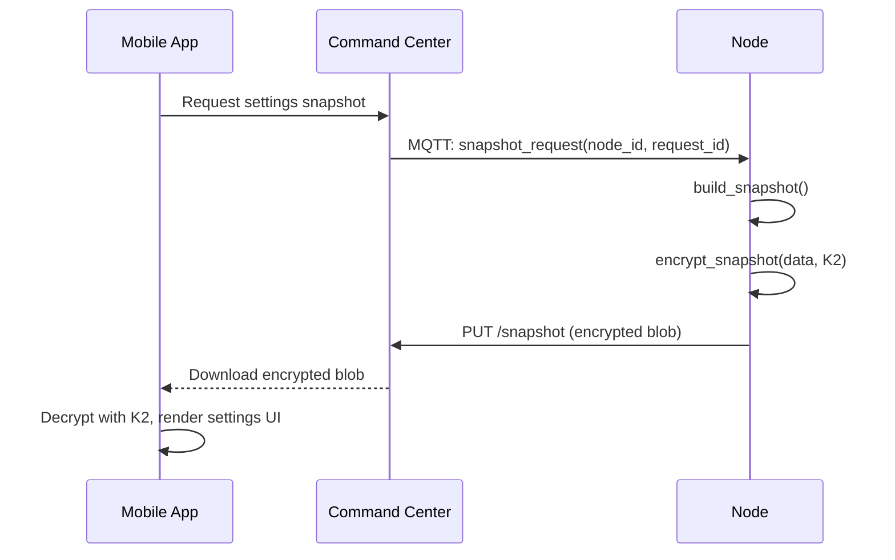

# Settings Snapshots

The settings snapshot system enables the mobile app to discover and configure command settings on nodes. It builds an encrypted summary of all commands, their secrets (metadata only), enabled state, authentication status, device families, and device managers --- then ships it to the mobile app via the command center.

**Module:** `services/settings_snapshot_service.py`

## How It Works

The snapshot flow involves five steps:



1. **Mobile requests** a settings snapshot via the command center
2. **Command center forwards** the request to the node over MQTT
3. **Node builds the snapshot** by enumerating all commands, device families, and device managers; collecting secrets metadata, enabled state, and auth config
4. **Node encrypts** the snapshot with AES-256-GCM using the shared K2 key
5. **Node uploads** the encrypted blob to the command center, where the mobile app downloads and decrypts it

## What is Included in a Snapshot

The `build_snapshot()` function assembles data from multiple sources:

### Commands

For each discovered command:

- **Secrets metadata** --- key name, description, scope, value type, friendly name, `is_set` (whether a value exists), and `is_sensitive` flag. Sensitive values are never included --- only metadata.
- **Enabled state** --- from the `CommandRegistryRepository`
- **Parameters** --- the command's parameter definitions for the mobile UI
- **Associated service** --- grouping label for the mobile settings screen (e.g., "OpenWeather", "Gmail")
- **Authentication config** --- from `CommandAuth`, whether OAuth needs to be completed and any error messages

### Device Families

For each discovered device family (local protocol integration):

- Family name and description
- Required secrets metadata (same format as commands)

### Device Managers

For each discovered device manager (cloud API integration):

- Manager name and description
- Required secrets metadata

### Example Snapshot Structure

```json
{
  "commands": {
    "get_weather": {
      "enabled": true,
      "associated_service": "OpenWeather",
      "secrets": [
        {
          "key": "OPENWEATHER_API_KEY",
          "friendly_name": "API Key",
          "description": "Open Weather API Key",
          "scope": "integration",
          "value_type": "string",
          "is_set": true,
          "is_sensitive": true
        },
        {
          "key": "OPENWEATHER_LOCATION",
          "friendly_name": "Default Location",
          "description": "Default weather location",
          "scope": "node",
          "value_type": "string",
          "is_set": true,
          "is_sensitive": false,
          "value": "Miami,FL,US"
        }
      ],
      "parameters": [...],
      "auth": null
    },
    "send_email": {
      "enabled": true,
      "associated_service": "Gmail",
      "secrets": [...],
      "parameters": [...],
      "auth": {
        "provider": "gmail",
        "needs_auth": true,
        "auth_error": null
      }
    }
  },
  "device_families": {...},
  "device_managers": {...}
}
```

Note that `OPENWEATHER_API_KEY` (sensitive) has no `value` field, while `OPENWEATHER_LOCATION` (non-sensitive) includes the current value. This is how the mobile app knows to show a masked placeholder for API keys but display the actual value for locations and preferences.

## Encryption

### `encrypt_snapshot(data, k2) -> bytes`

Encrypts the snapshot JSON with AES-256-GCM:

- **Algorithm:** AES-256-GCM (authenticated encryption)
- **Key:** K2, a shared 256-bit AES key
- **Nonce:** 12 random bytes, prepended to the ciphertext
- **Output:** `nonce (12 bytes) || ciphertext || tag (16 bytes)`

```python
import json

snapshot_data = build_snapshot()
json_bytes = json.dumps(snapshot_data).encode("utf-8")
encrypted = encrypt_snapshot(json_bytes, k2_key)
```

The mobile app performs the inverse: reads the 12-byte nonce, decrypts the rest with K2, and parses the resulting JSON.

### The K2 Key

K2 is a shared AES-256 key exchanged between the node and mobile app during provisioning. It is used exclusively for encrypting settings data in transit.

- **Provisioning:** exchanged via the BLE provisioning flow (see [Provisioning](../../clients/provisioning.md))
- **Development:** generate a dev key with `python utils/generate_dev_k2.py`
- **Storage:** stored in the node's encrypted SQLite database as a secret

```bash
# Generate a K2 key for development
python utils/generate_dev_k2.py
# Output: K2 key written to ~/.jarvis/k2.key
```

## Upload

### `upload_snapshot(node_id, request_id, encrypted) -> bool`

Uploads the encrypted blob to the command center via HTTP PUT:

```python
success = upload_snapshot(
    node_id="576f209e-4c46-4105-b785-6e76ccf579c9",
    request_id="req-abc-123",
    encrypted=encrypted_blob
)
```

The command center stores the blob temporarily and notifies the mobile app that the snapshot is ready for download.

## Full Orchestration

### `handle_snapshot_request(node_id, request_id)`

This is the top-level function called when the node receives a snapshot request over MQTT. It orchestrates the entire flow:

1. Calls `build_snapshot()` to enumerate commands, device families, and device managers
2. Serializes the snapshot to JSON
3. Reads the K2 key from the secret store
4. Calls `encrypt_snapshot()` to encrypt the JSON
5. Calls `upload_snapshot()` to PUT the encrypted blob to the command center

```python
from services.settings_snapshot_service import handle_snapshot_request

# Called by the MQTT handler when a snapshot request arrives
handle_snapshot_request(
    node_id="576f209e-4c46-4105-b785-6e76ccf579c9",
    request_id="req-abc-123"
)
```

## Config Push (Mobile to Node)

The snapshot flow is bidirectional. When a user changes a setting in the mobile app:

1. Mobile encrypts the updated values with K2
2. Mobile sends the encrypted payload to the command center
3. Command center forwards to the node via MQTT
4. Node decrypts with K2 and calls `set_secret()` for each changed value

This means the mobile app can configure API keys, toggle feature flags, and update preferences on any node --- all through the same encrypted channel.

## Mobile App Integration

The mobile app uses the snapshot to render per-command settings screens, grouped by `associated_service`:

```
Node: Office Pi
────────────────────────
OpenWeather
  API Key              ••••••••
  Units                imperial
  Default Location     Miami,FL,US

Gmail
  ⚠️ Authentication Required
  [Complete OAuth Setup]

Govee (Device Manager)
  API Key              ••••••••
  Default Room         living room
```

Each secret renders differently based on its metadata:

- `is_sensitive=True` --- masked input, user can enter a new value but never sees the current one
- `is_sensitive=False` --- plain text input showing the current value
- `value_type="bool"` --- toggle switch
- `value_type="int"` --- numeric stepper
- `needs_auth=True` --- shows an authentication prompt with a button to start the OAuth flow

## For Command Authors

You do not need to interact with the snapshot system directly. It works automatically based on your command's `required_secrets` declarations:

1. Declare your secrets with appropriate `scope`, `is_sensitive`, and `friendly_name` values
2. The snapshot system reads these declarations and includes them in the snapshot
3. The mobile app renders the settings UI
4. Users enter values, which are pushed to the node's secret store

The only thing you control is how your secrets are declared. See [Secrets Deep Dive](../../commands/secrets.md) for the full reference on `JarvisSecret` options.
