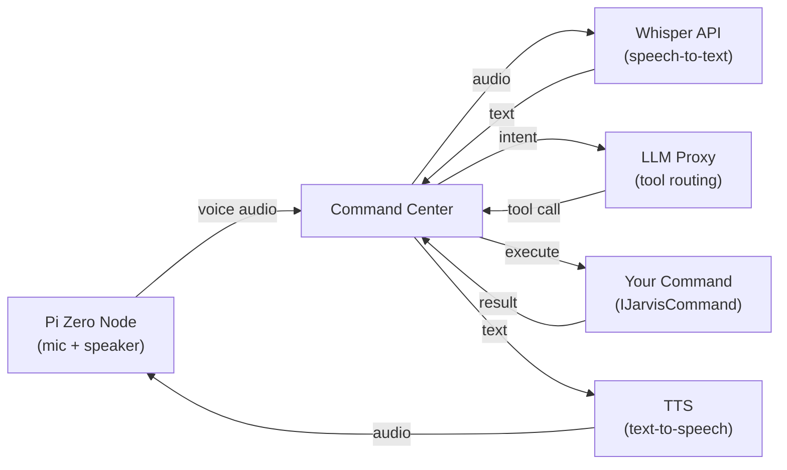

# Jarvis Developer Documentation

Jarvis is a fully private, self-hosted voice assistant built on Pi Zero nodes and a microservice backend. This documentation covers everything you need to build custom commands, understand the architecture, and deploy your own instance.

## Why Jarvis?

- **Fully private** — No cloud dependencies. All data stays on your network.
- **Self-hostable** — Same open-source codebase for local and cloud deployments.
- **Extensible** — Add capabilities by implementing a single Python interface.
- **Voice-first** — Wake word detection, speech-to-text, LLM routing, text-to-speech.

## Architecture at a Glance

## Quick Links

| | |
|---|---|
| **[Getting Started](getting-started/index.md)** | Install Jarvis, start services, and send your first voice command. |
| **[Extending Jarvis](extending/index.md)** | The plugin system — commands, agents, device adapters, prompt providers, and more. |
| **[Architecture](architecture/index.md)** | Understand the voice pipeline, service discovery, and authentication patterns. |
| **[Cloud Services](architecture/cloud.md)** | Pantry (command store), Notifications Relay, Web Chat, and the Command SDK. |
| **[Services](services/index.md)** | Reference for every microservice — APIs, configuration, and dependencies. |

## Built-in Commands

Jarvis ships with these commands out of the box:

| Command | Description |
|---------|-------------|
| `calculate` | Arithmetic operations |
| `control_device` | Smart home device control |
| `get_device_status` | Query smart home device state |
| `chat` | Open-ended LLM conversation |
| `answer_question` | Factual Q&A |
| `set_timer` | Countdown timers |
| `check_timers` | List active timers |
| `cancel_timer` | Cancel a running timer |
| `reminder` | Set, list, delete, and snooze reminders (with recurrence) |
| `routine` | Multi-step automations |
| `tell_a_joke` | Random jokes |
| `whats_up` | Morning briefing (weather + calendar + news) |
| `convert_measurement` | Unit conversions |
| `get_current_time` | Current time in any timezone |
| ... and more | See the full [command list](commands/index.md) |

Many commands that were previously built-in have been extracted to installable **[Pantry](architecture/cloud.md#pantry-command-store)** packages, including: `get_weather`, `get_news`, `get_sports_scores`, `search_web`, `tell_a_story`, `bluetooth`, `music`, `email`, `get_calendar_events`, and device families (Kasa, LIFX, Govee, Apple, Nest). Install them from the Pantry with a single CLI command.
