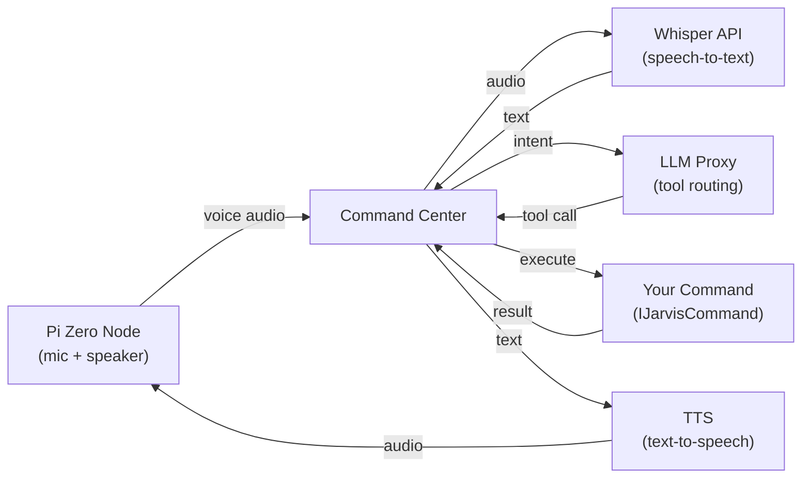

# Jarvis Automation

**A voice assistant you own completely.** Jarvis runs on your network, keeps your data private, and does what you tell it -- not what a corporation decides.

[:fontawesome-brands-discord: **Join the Discord**](https://discord.gg/9SuQFVexxJ){ .md-button } &nbsp; [:fontawesome-brands-github: GitHub](https://github.com/alexberardi/jarvis-server){ .md-button }

!!! note "Pre-release"
    Jarvis Automation is a **pre-release** (release candidate rc18): one server you install on a Mac, a Windows PC or a Linux machine, then finish in a setup wizard. Builds are on the [releases page](https://github.com/alexberardi/jarvis-server/releases). Start at **[Install](install/index.md)**.

    The old Docker/microservice install is retired for new users: it no longer installs out of the box (MinIO is gone). Its pages are kept, frozen, under [Legacy](legacy/index.md).

New to this? Read **[Why Jarvis?](getting-started/why-jarvis.md)** for the full picture.

## At a Glance

- **Fully private** — No cloud dependencies. All data stays on your network.
- **Self-hostable** — Same open-source codebase for local and cloud deployments.
- **Extensible** — Add capabilities by implementing a single Python interface.
- **Voice-first** — Wake word detection, speech-to-text, LLM routing, text-to-speech.
- **Speaker-aware** — Identifies who's speaking and remembers per-person preferences.
- **Multi-household by default** — Self-host once and share with anyone; friends and family add your server URL in the mobile app and create an account. Each household gets isolated voice profiles, devices, and routines.
- **Use anywhere** — Voice nodes, mobile app, web chat -- all connected to one backend.

## Architecture at a Glance

```mermaid
graph LR
    Node["Pi Zero Node<br/>(mic + speaker)"] -->|voice audio| CC["Command Center"]
    CC -->|audio| Whisper["Whisper API<br/>(speech-to-text)"]
    Whisper -->|text| CC
    CC -->|intent| LLM["LLM Proxy<br/>(tool routing)"]
    LLM -->|tool call| CC
    CC -->|execute| CMD["Your Command<br/>(IJarvisCommand)"]
    CMD -->|result| CC
    CC -->|text| TTS["TTS<br/>(text-to-speech)"]
    TTS -->|audio| Node
```

## Quick Links

| | |
|---|---|
| **[Install](install/index.md)** | Install the server, finish the setup wizard, and add the desktop agent, a voice node and the mobile app. |
| **[Build](extending/index.md)** | The plugin system — commands, agents, device adapters, prompt providers, and more. |
| **[Architecture](architecture/index.md)** | How `jarvisd` is built: its modules, the voice pipeline, authentication and security. |
| **[Pantry](pantry/index.md)** | The command store: install packages, or run your own. |
| **[Legacy](legacy/index.md)** | The old Docker/microservice install, kept frozen for existing installs. |

## Built-in Commands

Jarvis ships with these commands out of the box:

| Command | Description |
|---------|-------------|
| `calculate` | Arithmetic operations |
| `control_device` | Smart home device control |
| `get_device_status` | Query smart home device state |
| `chat` | Open-ended LLM conversation |
| `answer_question` | Factual Q&A |
| `set_timer` | Countdown timers |
| `check_timers` | List active timers |
| `cancel_timer` | Cancel a running timer |
| `reminder` | Set, list, delete, and snooze reminders (with recurrence) |
| `routine` | Multi-step automations |
| `tell_a_joke` | Random jokes |
| `whats_up` | Morning briefing (weather + calendar + news) |
| `convert_measurement` | Unit conversions |
| `get_current_time` | Current time in any timezone |
| ... and more | See the full [command list](commands/index.md) |

Many commands that were previously built-in have been extracted to installable **[Pantry](pantry/index.md)** packages, including: `get_weather`, `get_news`, `get_sports_scores`, `search_web`, `tell_a_story`, `bluetooth`, `music`, `email`, `get_calendar_events`, and device families (Kasa, LIFX, Govee, Apple, Nest). Install them from the Pantry with a single CLI command.
