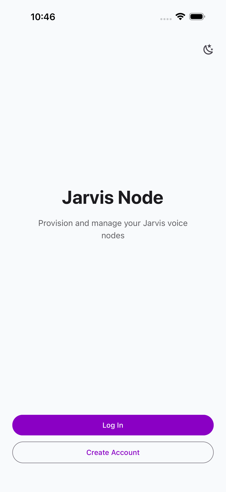
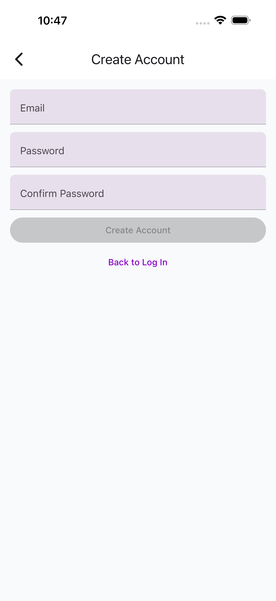
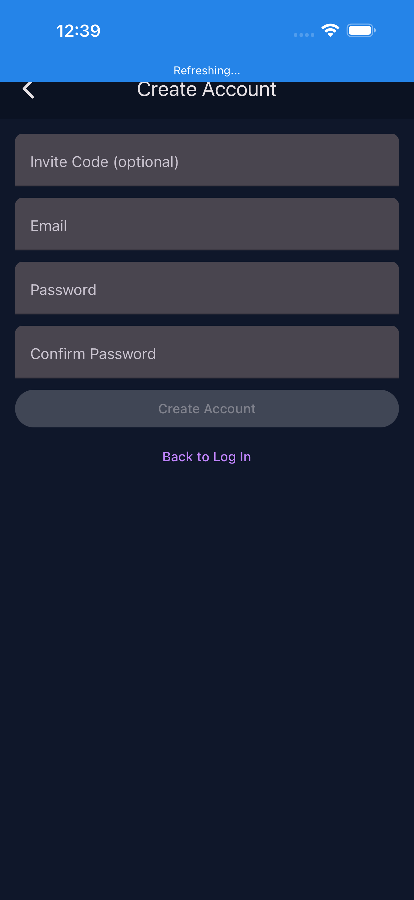
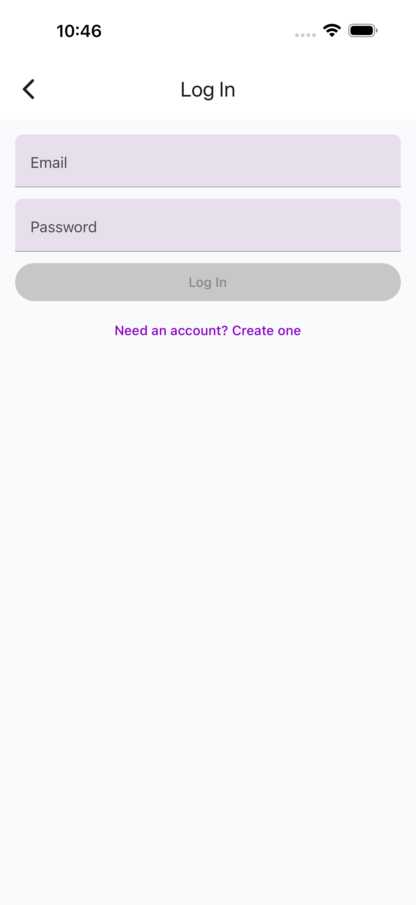
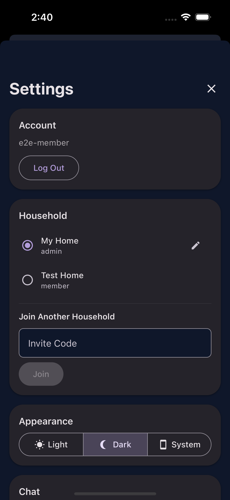

# Authentication

## Landing Screen

The landing screen appears when you're not logged in.

{ width="300" }

## Registration

Tap **Create Account** to register. Provide an email, username, and password. A default household ("My Home") is created automatically.

{ width="300" }

### Invite Codes

If you have an invite code from an existing household, enter it during registration to join that household directly instead of creating a new one.

{ width="300" }

## Login

{ width="300" }

Enter your email and password. After login, the app loads your households and connects to the command center.

## Multi-Household

Users can belong to multiple households. Switch between them in **Settings > Household**.

{ width="300" }

### Roles

| Role | Permissions |
|------|-------------|
| **Member** | Chat, view devices, run routines |
| **Power User** | + Create invite codes, register nodes |
| **Admin** | + Manage members, edit household, kick members |
