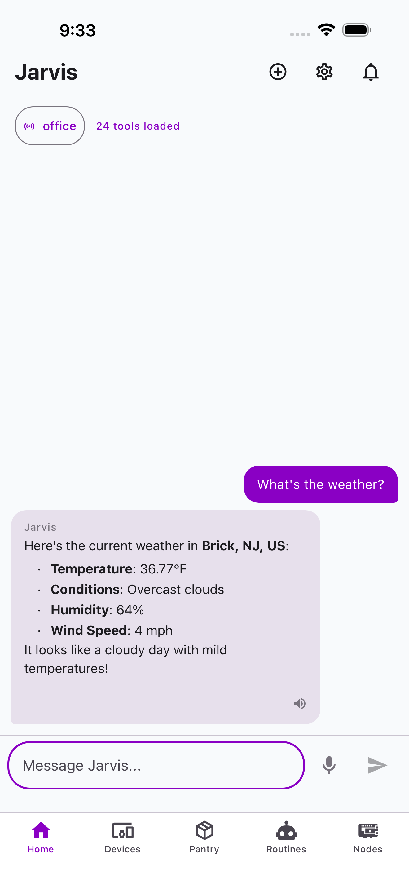
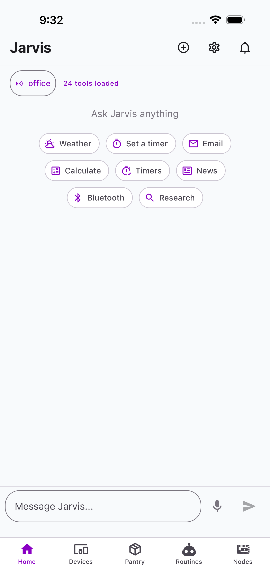
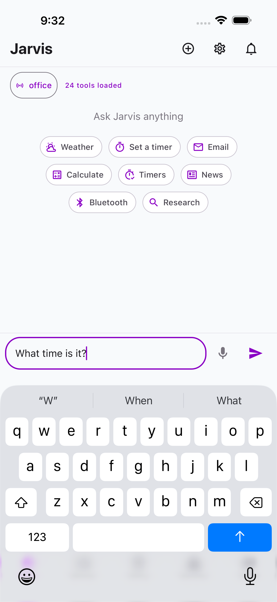

# Home & Chat

The Home tab is the main chat interface for interacting with Jarvis. Type or speak commands, and Jarvis responds with structured data and natural language.

## Chat Interface

{ width="300" }

The chat shows a conversation thread with your messages on the right (purple) and Jarvis responses on the left (gray). Responses can include formatted text with bold, lists, and structured data.

### Quick Actions

When the conversation is empty, quick action chips appear with common commands:

{ width="300" }

Tap any chip to send that command immediately. Available actions depend on which commands are installed on the selected node.

### Node Selector

The node selector at the top left shows which Pi Zero node is active. Tap it to switch between nodes in your household.

{ width="300" }

### Text Input

Type a message in the input field and tap the send arrow. Jarvis processes it through the command center, which routes it to the appropriate command on the selected node.

{ width="300" }

### Voice Input

Tap the microphone icon to record a voice message. The audio is transcribed by the Whisper service and processed as text.

### Auto-Play TTS

When enabled in Settings, Jarvis responses are automatically spoken aloud via the TTS service. A speaker icon appears on responses that have been played.

## Empty State

When no nodes are paired, the Home screen shows a welcome message with a prompt to add your first node.

<!-- Screenshot needed: Empty state with no nodes paired -->

## Tool Loading

The status bar below the node selector shows how many tools (commands) are loaded. This confirms the node is connected and ready.
