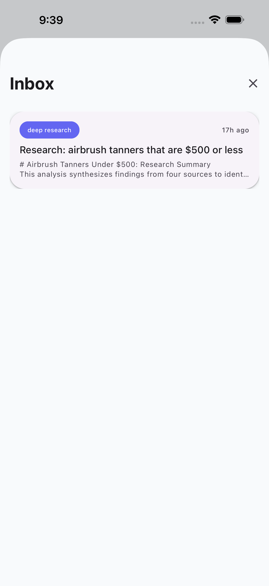

# Inbox

The Inbox shows notifications and results from background tasks. Access it by tapping the bell icon in the Home screen header.

{ width="300" }

## Notification Types

| Type | Source | Description |
|------|--------|-------------|
| Deep Research | `research` tool | Multi-source web research summaries |
| Alerts | Background agents | VIP emails, urgent messages, calendar reminders |

## Deep Research

When you ask Jarvis to research a topic, the results are delivered to your Inbox as a detailed report. Tap an item to view the full research summary with sources.

{ width="300" }

## Badge Count

The bell icon shows an unread count badge when new items arrive. The count refreshes when you return to the Home tab.
