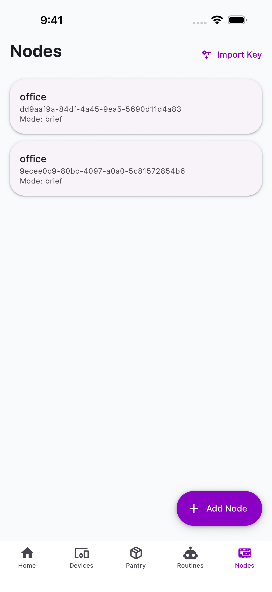

# Nodes

The Nodes tab manages your Pi Zero voice nodes --- the physical devices that capture voice commands.

{ width="300" }

## Node List

Each node card shows:

- Room name
- Node ID
- Operating mode (brief/full)

Tap a node to view its detail screen with settings, installed commands, and status.

## Adding a Node

Tap **Add Node** to start the provisioning flow:

1. **Scan** --- The app scans for nearby Jarvis nodes broadcasting a WiFi access point
2. **Connect** --- Connect to the node's AP network
3. **Configure** --- Enter your home WiFi credentials
4. **Register** --- The node registers with the command center

!!! tip
    For development, you can use **Import Key** (top right) to manually pair a node by pasting its K2 encryption key.

## Node Settings

From a node's detail screen you can:

- View installed commands and their settings
- Configure command secrets (API keys, credentials)
- Trigger device discovery
- View node status and connection info
