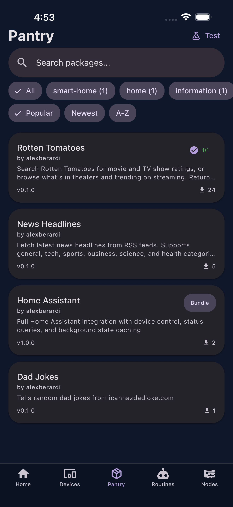

# Pantry (Package Store)

The Pantry tab lets you browse, search, and install community packages from the Jarvis package store.

{ width="300" }

## Browsing

Packages are organized by category and can be filtered by type:

- **Commands** --- Voice commands (weather, news, email, etc.)
- **Bundles** --- Multi-component packages (command + agent + device adapter)
- **Routines** --- Installable multi-step voice automations

Each package card shows the display name, author, description, install count, and verification status.

## Installing

1. Tap a package to view its detail page
2. Tap **Install**
3. Select which node(s) to install on
4. Wait for the install progress screen to complete

The node downloads the package from GitHub, validates it, installs dependencies, and registers the new commands.

!!! note
    After installing a package, the Home screen's tool count updates to reflect the new commands available.

## Package Types

| Type | Description |
|------|-------------|
| Command | Single voice command (e.g., weather lookup) |
| Bundle | Multi-component: commands + agents + device adapters |
| Routine | JSON-defined multi-step automation with placeholders |
