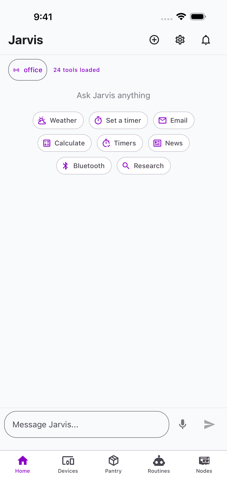

# Routines

The Routines tab manages multi-step voice automations. Routines chain multiple commands together and compose the results into a natural spoken response.

{ width="300" }

## Routine Types

| Type | Icon | Description |
|------|------|-------------|
| On-demand | Microphone | Triggered by voice ("good morning") |
| Interval | Timer | Runs every N minutes in background |
| Cron | Calendar | Runs on specific days/times |

## Creating Routines

Tap the **+** button for two options:

- **New Routine** --- Manual editor with drag-and-drop step ordering
- **AI Builder** --- Describe what you want in natural language and Jarvis generates the routine

### Manual Editor

The editor lets you:

- Set a name and trigger phrases (3+ required)
- Add steps by selecting commands and configuring parameters
- Reorder steps by dragging
- Set response instructions (how Jarvis should summarize the results)
- Configure background scheduling (optional)

### AI Builder

Describe your routine in plain English (e.g., "a morning briefing that gets the weather, my calendar, and top news"). The AI generates the routine JSON, which you can test and edit before saving.

## Placeholders

Routines from the Pantry may include device placeholders --- abstract references like "living room lights" that need to be mapped to your actual devices. A "Configure devices" chip appears on routines that need setup.

## Export & Import

- **Export**: Tap the three-dot menu on any routine and select "Export" to share it via the OS share sheet
- **Import**: Tap the **+** button and select "Import from Clipboard" to import a shared routine JSON
