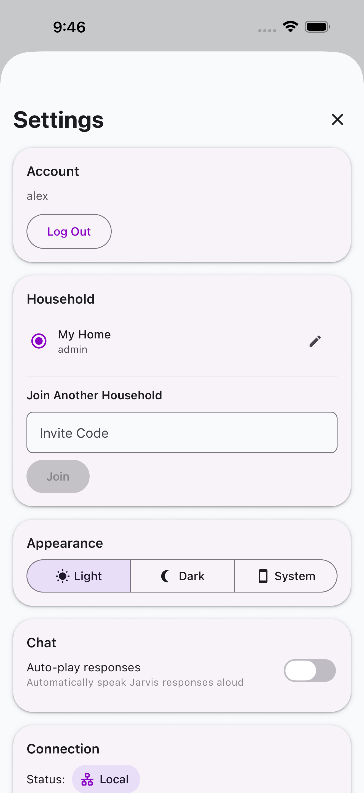
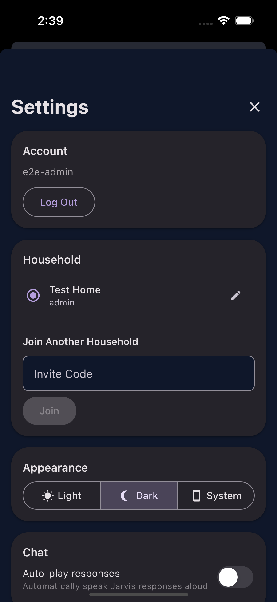
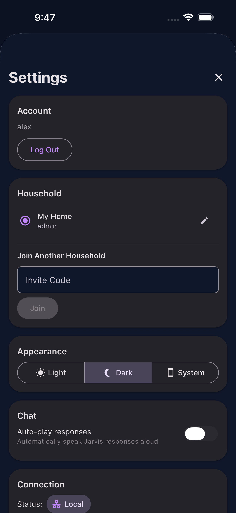
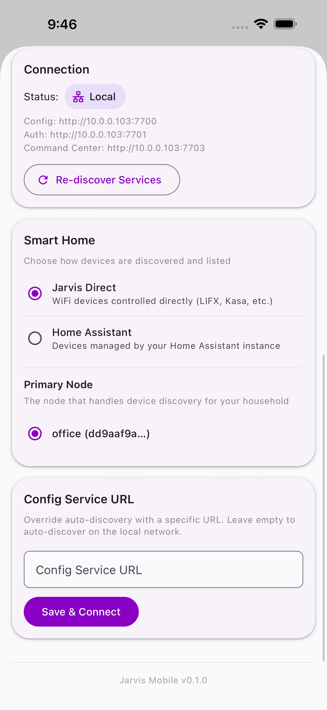

# Settings

Access Settings by tapping the gear icon in the Home screen header.

{ width="300" }

## Account

Shows your username and provides a **Log Out** button.

## Household

Manage your household membership:

- **Switch households** --- Tap a household to make it active
- **Edit household** --- Tap the pencil icon to rename, manage members, or create invite codes
- **Join another household** --- Enter an invite code to join
- **Create new household** --- Create a fresh household
- **Leave household** --- Available when you belong to multiple households

{ width="300" }

### Member Management (Admin)

Admins can manage household members:

{ width="300" }

- Change member roles (Member, Power User, Admin)
- Remove members from the household
- Create and revoke invite codes

## Appearance

Toggle between **Light**, **Dark**, and **System** themes.

{ width="300" }

## Chat

- **Auto-play responses** --- Automatically speak Jarvis responses via TTS

## Smart Home

Configure smart home integration:

- Select a primary node for device discovery
- Toggle external device protocols
- Connect to Home Assistant

{ width="300" }

## Connection

Shows whether the app is connected to a local or cloud Jarvis instance.
