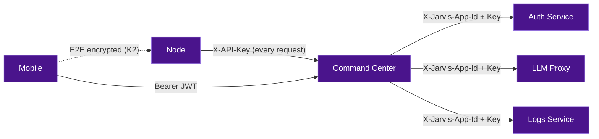

# Security

Jarvis is designed with privacy and security as core principles. All data stays on your network by default, with no cloud dependencies required.

!!! tip "Staying fully local"
    Every outbound-internet capability is opt-in and defaults to off. See [Network Egress & Offline Mode](offline-mode.md) for the complete list of toggles and how to run air-gapped — or how to enable updates.

## Zero-Trust Architecture

Jarvis follows a **zero-trust security model** --- no service, node, or client is implicitly trusted, regardless of network location. Every request is authenticated and verified independently at every boundary.

Most self-hosted assistants rely on "it's on my LAN, so it's fine." Jarvis does not. Even services running on the same Docker network authenticate to each other on every call.

**How this manifests in practice:**

| Principle | Implementation |
|-----------|---------------|
| **Verify explicitly** | Every service-to-service call carries `X-Jarvis-App-Id` + `X-Jarvis-App-Key` headers. The receiving service validates them against `jarvis-auth` --- it never assumes the caller is legitimate. |
| **Never trust the caller** | The command center does not cache "this node is trusted." Every node request is validated with the auth service via the `X-API-Key` header. |
| **Encrypt at rest** | Node secrets (API keys, OAuth tokens) are stored in AES-256 encrypted SQLite (pysqlcipher3). The encryption key (K1) never leaves the device. |
| **Encrypt in transit** | Settings sync between mobile and node is end-to-end encrypted with AES-256-GCM (K2 key). The command center transports the encrypted blob but cannot read it. |
| **Least privilege** | Nodes are scoped to a household. App-to-app keys are scoped per service. Admin endpoints require a separate `ADMIN_API_KEY`. |
| **Assume breach** | Even if the Docker network is compromised, an attacker cannot impersonate a service without valid app credentials, or read node secrets without the device's K1 key. |



!!! note "Roadmap items"
    Two items will strengthen the zero-trust posture further: **mTLS between services** (Phase 2 on the [compliance roadmap](compliance-roadmap.md)) and **RBAC with per-request authorization scoping** (Phase 4). The trust boundaries are already in place --- these additions add defense-in-depth.

## Authentication Patterns

Jarvis uses three authentication patterns depending on who is communicating:

### 1. Node Authentication

Pi Zero nodes authenticate to backend services using an API key:

```
X-API-Key: {node_id}:{api_key}
```

The receiving service validates the key against `jarvis-auth`. Node credentials are created during provisioning and stored in the node's encrypted local database.

### 2. App-to-App Authentication

Backend services authenticate to each other using service credentials:

```
X-Jarvis-App-Id: <app_id>
X-Jarvis-App-Key: <app_key>
```

App credentials are generated by `./jarvis init` and stored in each service's `.env` file. Services validate incoming app-to-app requests against `jarvis-auth` via `POST /internal/validate-app`.

### 3. User Authentication (JWT)

Human users (mobile app, admin UI) authenticate with JWT bearer tokens:

```
Authorization: Bearer <jwt_access_token>
```

JWTs are issued by `jarvis-auth` on login, signed with HS256 using a shared secret key. Access tokens are short-lived; refresh tokens are hashed and stored in PostgreSQL.

## Encrypted Local Storage

Pi Zero nodes store secrets (API keys, OAuth tokens, command credentials) in a local SQLite database encrypted with [PySQLCipher](https://github.com/niccokunzmann/pysqlcipher3). The encryption key (K1) is generated on first boot.

Settings sync between the mobile app and nodes uses a shared AES-256 key (K2), exchanged during provisioning.

## Setup Wizard Probe Endpoint (SSRF Hardening)

The `jarvis-admin` setup wizard's `/probe` endpoint (used to validate a service URL the operator enters before it's saved) is unauthenticated by design --- there's no superuser account yet at that point in the flow. To keep this from being a standing SSRF primitive:

- **Pre-install only.** Once setup has completed, `/probe` returns `403` on every call.
- **Cloud-metadata and link-local targets are blocked**, even during setup: `169.254.0.0/16` (including the `169.254.169.254` cloud-metadata address) and `fe80::/10`. This is checked against the resolved IP, not just the hostname string, so a DNS name that resolves into a blocked range is caught too.
- **RFC1918 and localhost stay allowed** --- the wizard legitimately needs to probe LAN service URLs (e.g. `http://10.0.0.5:7701`, `http://localhost:7700`).
- Probe requests never follow redirects (`redirect: 'manual'`), so a target can't 3xx-redirect the probe into a blocked address after the initial check passes.

## Admin Traces Endpoint Authorization

Command-center's admin trace router (`/api/v0/admin/traces`, raw voice/chat transcripts across every household) is now gated behind `verify_admin_key` (the same `X-Api-Key` admin token the admin dashboard already sends), matching the mobile trace router which already required a JWT. A missing or wrong key returns `400`/`401`.

## No Cloud Dependencies

By default, Jarvis runs entirely on your local network:

- Speech-to-text runs locally via whisper.cpp
- LLM inference runs locally via MLX (macOS) or llama.cpp (Linux)
- Text-to-speech runs locally via Piper TTS (default) or Kokoro TTS (optional); no cloud calls
- All data is stored in your PostgreSQL instance
- No telemetry, no external API calls (unless you configure them)

## Credential Rotation

App-to-app credentials can be regenerated by running `./jarvis init --force`, which generates new tokens and updates all service `.env` files. Node credentials can be rotated by re-registering the node.

## Multi-Tenant Isolation

All data is scoped by `household_id`. Users can only access data within their household. Nodes belong to a household and can only submit commands for that household's users.

## Compliance Roadmap

For B2B deployments (hospitals, law firms, enterprises), Jarvis has a phased security roadmap targeting HIPAA, SOC2 Type II, HITRUST CSF, FedRAMP, ISO 27001, and PCI DSS compliance.

See the [Compliance Roadmap](compliance-roadmap.md) for details.
