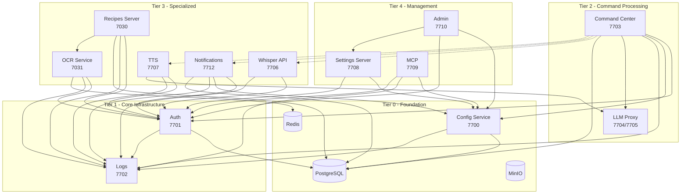

# Services

Jarvis is composed of small, focused microservices. Each runs as a Docker container (or locally for GPU-dependent workloads on macOS) and communicates over HTTP with app-to-app authentication.

## Service Inventory

| Service | Port | Description | Tier |
|---------|------|-------------|------|
| [Config Service](config-service.md) | 7700 | Service discovery hub | 0 - Foundation |
| [Auth](auth.md) | 7701 | JWT authentication, app-to-app auth | 1 - Core Infra |
| [Logs](logs.md) | 7702 | Centralized logging via Loki/Grafana | 1 - Core Infra |
| [Command Center](command-center.md) | 7703 | Voice command orchestrator | 2 - Command Processing |
| [LLM Proxy](llm-proxy.md) | 7704/7705 | LLM inference (MLX/GGUF/vLLM) | 2 - Command Processing |
| [Whisper API](whisper-api.md) | 7706 | Speech-to-text via whisper.cpp | 3 - Specialized |
| [TTS](tts.md) | 7707 | Text-to-speech via Piper | 3 - Specialized |
| [OCR Service](ocr-service.md) | 7031 | OCR with multiple backends | 3 - Specialized |
| [Recipes Server](recipes-server.md) | 7030 | Recipe CRUD and meal planning | 3 - Specialized |
| [Notifications](notifications.md) | 7712 | Push notifications and inbox | 3 - Specialized |
| [Settings Server](settings-server.md) | 7708 | Settings aggregator | 4 - Management |
| [MCP](mcp.md) | 7709 | Claude Code integration | 4 - Management |
| [Admin](admin.md) | 7710 | Web admin UI | 5 - Clients |

## Dependency Tiers

Services are organized into tiers based on how foundational they are:

- **Tier 0 (Foundation)** -- Must be running for anything to work. Config Service and PostgreSQL.
- **Tier 1 (Core Infrastructure)** -- Auth and Logs. Most services depend on auth; logs degrade gracefully.
- **Tier 2 (Command Processing)** -- Command Center and LLM Proxy. The voice command pipeline.
- **Tier 3 (Specialized)** -- Domain services (whisper, TTS, OCR, recipes, notifications). Each is independently optional.
- **Tier 4 (Management)** -- Settings, MCP, admin tools. Used for configuration and development.
- **Tier 5 (Clients)** -- End-user interfaces (admin web UI, mobile app, Pi nodes).

## Dependency Graph

## Critical Path: Voice Commands

For end-to-end voice commands to work, these services must be running:

1. **Config Service** (service discovery)
2. **Auth** (node and app-to-app authentication)
3. **Command Center** (voice orchestration)
4. **LLM Proxy** (intent parsing and response generation)
5. *Whisper API* (speech-to-text, if using server-side transcription)
6. *TTS* (voice responses, optional)
7. *Logs* (optional, services degrade gracefully to console logging)

## Communication Patterns

All inter-service communication uses HTTP. See [Authentication](../architecture/authentication.md) for details on the three auth modes:

- **App-to-app auth**: `X-Jarvis-App-Id` + `X-Jarvis-App-Key` headers
- **Node auth**: `X-API-Key` header (node_id:node_key)
- **User auth**: `Authorization: Bearer <jwt>` header
