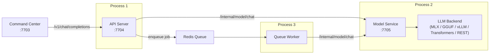
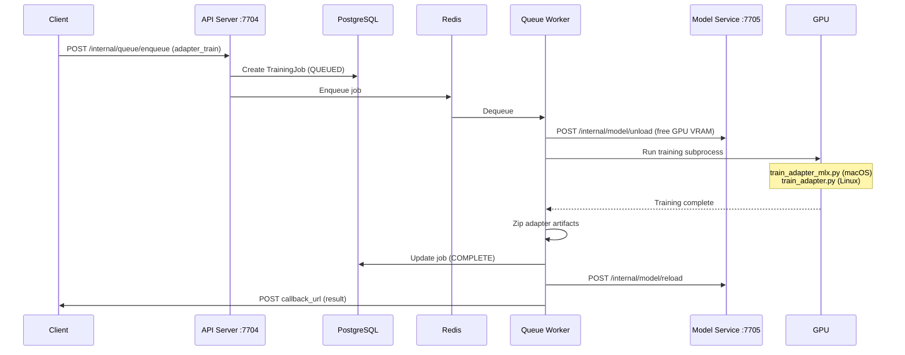

# LLM Proxy

The LLM proxy provides a unified inference API across multiple backends --- MLX (Apple Silicon), GGUF (llama.cpp), vLLM (NVIDIA), Transformers (HuggingFace), and REST (remote APIs). It runs a **2-model system** (`live` for real-time voice commands, `background` for async tasks), manages LoRA adapter training and loading, and processes async jobs via a Redis queue.

## Quick Reference

| | |
|---|---|
| **Ports** | 7704 (API server), 7705 (model service) |
| **Health endpoint** | `GET /health` |
| **Source** | `jarvis-llm-proxy-api/` |
| **Framework** | FastAPI + Uvicorn |
| **Tier** | 2 --- Command Processing |

## Architecture

The service runs as **three processes**, started by `run.sh`:



| Process | Port | Purpose |
|---------|------|---------|
| **API Server** | 7704 | Public-facing FastAPI app. Proxies chat requests to the model service, serves settings/training/pipeline endpoints. Does not load models. |
| **Model Service** | 7705 | Internal FastAPI app. Owns `ModelManager`, loads backends, runs inference. Protected by `X-Internal-Token`. |
| **Queue Worker** | --- | RQ (Redis Queue) worker. Processes async jobs: background chat, adapter training, vision inference. Always uses the `background` model. |

!!! note "macOS exception"
    On macOS, the model service is disabled (`RUN_MODEL_SERVICE=false`). The API server loads models in-process to access Metal/MLX directly. The `jarvis` CLI handles this automatically.

## 2-Model System

The service maintains two model slots to balance latency and capability:

| Slot | Purpose | Used By | Example |
|------|---------|---------|---------|
| **live** | Real-time voice commands. Optimized for low latency. | Chat endpoint (default) | Qwen3-14B-Q6_K.gguf |
| **background** | Heavier async tasks. Can be a larger model. | Queue worker (always) | Qwen3-32B-Q4_K_M.gguf |

**Memory optimization:** If both slots resolve to the same model path and backend type, `ModelManager` creates only one backend instance and shares it. This saves ~50% memory on constrained hardware.

### Configuration Cascade

Each model slot checks settings in order: **DB setting** -> **environment variable** -> **legacy fallback** -> **default**.

```
Live model:
  Backend: model.live.backend → JARVIS_LIVE_MODEL_BACKEND → JARVIS_MODEL_BACKEND → "GGUF"
  Path:    model.live.name    → JARVIS_LIVE_MODEL_NAME    → JARVIS_MODEL_NAME

Background model:
  Backend: model.background.backend → JARVIS_BACKGROUND_MODEL_BACKEND → (falls back to live)
  Path:    model.background.name    → JARVIS_BACKGROUND_MODEL_NAME    → (falls back to live)
```

### Hot Swap

Models can be swapped at runtime without restarting the service:

- `POST /internal/model/unload` --- unloads all models (used before adapter training to free GPU VRAM)
- `POST /internal/model/reload` --- reloads models from current settings

## Inference Backends

All backends extend `LLMBackendBase` and implement `generate_text_chat()` and `unload()`. Optional methods include `generate_vision_chat()`, `generate_text_chat_stream()`, `load_adapter()`, and `remove_adapter()`.

### GGUF (llama.cpp)

The primary local backend. Works on all platforms.

| | |
|---|---|
| **Library** | `llama-cpp-python` |
| **GPU** | Metal (macOS), CUDA (Linux) |
| **Adapter support** | Constructor-based reload (destroys + recreates model with `lora_path`) |
| **Multi-GPU** | Yes, via `JARVIS_GGUF_TENSOR_SPLIT` (e.g., `"0.5,0.5"` for 2 GPUs) |

Features:

- Thread-safe inference via `threading.Lock`
- Context caching (hash-based prefix matching)
- Flash attention support (`JARVIS_FLASH_ATTN=true`)
- Mirostat sampling
- Warmup inference on load

Key env vars: `JARVIS_N_GPU_LAYERS` (-1 for all), `JARVIS_N_THREADS`, `JARVIS_N_BATCH` (512), `JARVIS_FLASH_ATTN` (true), `JARVIS_GGUF_SPLIT_MODE`, `JARVIS_GGUF_TENSOR_SPLIT`.

### MLX (Apple Silicon)

Native Apple Silicon backend using the MLX framework.

| | |
|---|---|
| **Library** | `mlx-lm` |
| **GPU** | Metal (unified memory) |
| **Adapter support** | In-place weight swap --- no model reload needed |
| **Platform** | macOS only |

Features:

- Sophisticated KV cache prefix matching --- finds common prefix between cached and new tokens, trims cache, only processes the suffix. This dramatically speeds up repeated system prompts.
- Dynamic LoRA adapter swap via `mlx_lm.tuner.utils.load_adapters()` / `remove_lora_layers()` (modifies weights in place)
- Vision support via PIL image handling

### vLLM (High-Throughput GPU)

High-throughput backend for Linux with NVIDIA GPUs.

| | |
|---|---|
| **Library** | `vllm` |
| **GPU** | CUDA (NVIDIA) |
| **Adapter support** | Per-request LoRA via `LoRARequest` --- no reload, concurrent adapters |
| **Multi-GPU** | Yes, via `tensor_parallel_size` |

Features:

- Native prefix caching
- Per-request LoRA selection (multiple adapters served concurrently)
- JSON structured output via `StructuredOutputsParams`
- Manual chat template formatting (ChatML, Llama3, Mistral)
- Supports GGUF files with explicit tokenizer override

Key env vars: `JARVIS_VLLM_TENSOR_PARALLEL_SIZE`, `JARVIS_VLLM_GPU_MEMORY_UTILIZATION` (0.9), `JARVIS_VLLM_MAX_LORAS` (1), `JARVIS_VLLM_MAX_LORA_RANK` (64).

### Transformers (HuggingFace)

General-purpose backend using the HuggingFace ecosystem.

| | |
|---|---|
| **Library** | `transformers`, `torch` |
| **GPU** | CUDA, MPS, CPU (auto-detected) |
| **Adapter support** | PEFT LoRA via `PeftModel.from_pretrained()` |
| **Quantization** | BitsAndBytes 4-bit / 8-bit |

Key env vars: `JARVIS_DEVICE`, `JARVIS_TORCH_DTYPE`, `JARVIS_USE_QUANTIZATION`, `JARVIS_QUANTIZATION_TYPE`.

### REST (Remote API Proxy)

Proxies inference to remote APIs --- useful for cloud LLMs, hosted inference servers, or distributed setups. This is how you connect Jarvis to OpenAI, Anthropic, Ollama on another machine, or your own hosted GPU server.

| | |
|---|---|
| **Library** | `httpx` (async) |
| **Providers** | OpenAI, Anthropic, Ollama, LM Studio, generic |
| **Auth** | Bearer token, API key, or custom headers |
| **Vision** | Yes (converts images to data URLs) |

#### Quick Setup

Set the backend to `REST` and point it at your provider:

=== "OpenAI"

    ```bash
    # In .env or via settings DB
    JARVIS_LIVE_MODEL_BACKEND=REST
    JARVIS_LIVE_REST_MODEL_URL=https://api.openai.com
    JARVIS_REST_PROVIDER=openai
    JARVIS_REST_MODEL_NAME=gpt-4o
    JARVIS_REST_AUTH_TYPE=bearer
    JARVIS_REST_AUTH_TOKEN=sk-your-api-key
    ```

=== "Anthropic"

    ```bash
    JARVIS_LIVE_MODEL_BACKEND=REST
    JARVIS_LIVE_REST_MODEL_URL=https://api.anthropic.com
    JARVIS_REST_PROVIDER=anthropic
    JARVIS_REST_MODEL_NAME=claude-sonnet-4-20250514
    JARVIS_REST_AUTH_TYPE=api_key
    JARVIS_REST_AUTH_TOKEN=sk-ant-your-api-key
    ```

=== "Ollama (remote)"

    ```bash
    JARVIS_LIVE_MODEL_BACKEND=REST
    JARVIS_LIVE_REST_MODEL_URL=http://192.168.1.50:11434
    JARVIS_REST_PROVIDER=ollama
    JARVIS_REST_MODEL_NAME=qwen2.5:14b
    JARVIS_REST_AUTH_TYPE=none
    ```

=== "Self-hosted GPU server"

    ```bash
    JARVIS_LIVE_MODEL_BACKEND=REST
    JARVIS_LIVE_REST_MODEL_URL=https://llm.yourdomain.com
    JARVIS_REST_PROVIDER=openai
    JARVIS_REST_MODEL_NAME=your-model
    JARVIS_REST_AUTH_TYPE=bearer
    JARVIS_REST_AUTH_TOKEN=your-server-token
    JARVIS_REST_REQUEST_FORMAT=openai
    ```

#### Hybrid Setup (Local Live + Cloud Background)

You can mix local and remote backends --- e.g., fast local model for real-time voice, larger cloud model for deep research:

```bash
# Live: local GGUF for low-latency voice commands
JARVIS_LIVE_MODEL_BACKEND=GGUF
JARVIS_LIVE_MODEL_NAME=.models/Qwen3-14B-Q6_K.gguf

# Background: cloud model for async tasks (deep research, summarization)
JARVIS_BACKGROUND_MODEL_BACKEND=REST
JARVIS_BACKGROUND_REST_MODEL_URL=https://api.openai.com
JARVIS_REST_BACKGROUND_MODEL_NAME=gpt-4o
JARVIS_REST_AUTH_TYPE=bearer
JARVIS_REST_AUTH_TOKEN=sk-your-api-key
```

#### Full REST Configuration

| Variable | Default | Description |
|----------|---------|-------------|
| `JARVIS_LIVE_REST_MODEL_URL` | --- | Base URL for live model API |
| `JARVIS_BACKGROUND_REST_MODEL_URL` | --- | Base URL for background model API (falls back to live) |
| `JARVIS_REST_PROVIDER` | `generic` | Provider type: `openai`, `anthropic`, `ollama`, `lmstudio`, `generic` |
| `JARVIS_REST_MODEL_NAME` | --- | Model name for live requests |
| `JARVIS_REST_BACKGROUND_MODEL_NAME` | --- | Model name for background requests |
| `JARVIS_REST_AUTH_TYPE` | `none` | Auth type: `bearer`, `api_key`, `custom`, `none` |
| `JARVIS_REST_AUTH_TOKEN` | --- | Auth token or API key |
| `JARVIS_REST_AUTH_HEADER` | `Authorization` | Custom auth header name (for `custom` auth type) |
| `JARVIS_REST_REQUEST_FORMAT` | `openai` | Request format: `openai`, `ollama`, `chatml`, `generic` |
| `JARVIS_REST_TIMEOUT` | `60` | Request timeout in seconds |

The provider setting controls response parsing (different APIs return results in different shapes). The request format controls how messages are serialized. For most OpenAI-compatible APIs (vLLM, LM Studio, text-generation-webui), use `provider=openai` + `request_format=openai`.

### Mock (Testing)

Returns `[mock-text:model] <input>`. Used in tests.

### Backend Comparison

| Backend | Platform | Adapter Loading | Multi-GPU | Streaming | Vision |
|---------|----------|----------------|-----------|-----------|--------|
| **GGUF** | All | Model reload | Tensor split | Yes | Separate backend |
| **MLX** | macOS | In-place swap | N/A (unified) | Yes | Yes |
| **vLLM** | Linux+CUDA | Per-request | Tensor parallel | Yes | Separate backend |
| **Transformers** | All | PEFT merge | device_map | No | Separate backend |
| **REST** | All (network) | N/A | N/A | No | Yes |

## Redis Queue

Async jobs are processed via [RQ (Redis Queue)](https://python-rq.org/). The queue worker runs as a separate process and always uses the **background** model.

### Job Types

| Type | Description | Callback |
|------|-------------|----------|
| `chat` | Background LLM inference | Posts result to callback URL |
| `adapter_train` | LoRA adapter training | Posts job status to callback URL |
| `vision` | Vision inference (image + text) | Posts result to callback URL |

### Submitting Jobs

```
POST /internal/queue/enqueue
```

```json
{
  "job_id": "unique-id",
  "job_type": "chat",
  "request": { "messages": [...], "model": "background" },
  "callback_url": "http://jarvis-command-center:7703/api/v0/callback",
  "ttl_seconds": 300,
  "idempotency_key": "optional-dedup-key"
}
```

### Deduplication

Jobs with the same `job_id` + `idempotency_key` are deduplicated via Redis `SET NX` with a TTL. This prevents duplicate training jobs or repeated inference requests.

### Configuration

| Variable | Default | Description |
|----------|---------|-------------|
| `REDIS_URL` | --- | Full Redis connection URL |
| `REDIS_HOST` | localhost | Redis host (if `REDIS_URL` not set) |
| `REDIS_PORT` | 6379 | Redis port |
| `REDIS_DB` | 0 | Redis database number |
| `REDIS_PASSWORD` | --- | Redis password |
| `LLM_PROXY_QUEUE_NAME` | `llm_proxy_jobs` | Queue name |
| `RUN_QUEUE_WORKER` | true | Whether to start the worker process |

## LoRA Adapter Training

The service manages the full adapter lifecycle: training, storage, caching, and inference-time loading.

### Training Flow



### Training Parameters

| Variable | Default | Description |
|----------|---------|-------------|
| `JARVIS_ADAPTER_LORA_R` | 16 | LoRA rank |
| `JARVIS_ADAPTER_LORA_ALPHA` | 32 | LoRA alpha (scaling) |
| `JARVIS_ADAPTER_LORA_DROPOUT` | --- | Dropout rate |
| `JARVIS_ADAPTER_LEARNING_RATE` | --- | Learning rate |
| `JARVIS_ADAPTER_EPOCHS` | --- | Number of training epochs |
| `JARVIS_ADAPTER_BATCH_SIZE` | --- | Training batch size |
| `JARVIS_ADAPTER_MAX_SEQ_LEN` | --- | Max sequence length |
| `JARVIS_ADAPTER_TRAIN_DTYPE` | --- | Training dtype |
| `JARVIS_ADAPTER_TRAIN_LOAD_IN_4BIT` | --- | 4-bit quantized training |

### Adapter Storage

Adapters are stored locally and optionally synced to S3/MinIO:

- **Local cache:** `LLM_PROXY_ADAPTER_DIR` (default: `/tmp/jarvis-adapters`)
- **S3 storage:** `s3://{bucket}/{prefix}/{dataset_hash}/adapter.zip`
- **LRU cache:** In-memory adapter path cache (max 10 entries, configurable) with optional disk eviction

Resolution order: local cache -> local zip extraction -> S3 download.

### Adapter Loading at Inference

Adapters are loaded per-request via the `adapter_settings` field in chat requests:

```json
{
  "messages": [...],
  "adapter_settings": {
    "hash": "abc123",
    "scale": 1.0,
    "enabled": true
  }
}
```

How each backend handles this:

| Backend | Mechanism | Reload Required |
|---------|-----------|-----------------|
| GGUF | Destroys model, recreates with `lora_path` | Yes (full reload) |
| MLX | `load_adapters()` / `remove_lora_layers()` | No (in-place swap) |
| vLLM | `LoRARequest` per request | No (concurrent) |
| Transformers | `PeftModel.from_pretrained()` | Partial (merge/unmerge) |

## Pipeline System

The pipeline system orchestrates multi-step model builds: generate training data -> train adapter -> validate -> merge -> convert to GGUF/MLX.

| Method | Path | Description |
|--------|------|-------------|
| `POST` | `/v1/pipeline/build` | Start pipeline build |
| `GET` | `/v1/pipeline/status` | Current pipeline status |
| `POST` | `/v1/pipeline/cancel` | Cancel running pipeline |
| `GET` | `/v1/pipeline/logs` | SSE stream of build logs |
| `GET` | `/v1/pipeline/artifacts` | List models/adapters/GGUF/MLX on disk |

Pipeline endpoints require superuser JWT authentication.

## Embeddings

A separate `EmbeddingManager` provides text embeddings via `sentence-transformers`:

```
POST /v1/embeddings
```

| Variable | Default | Description |
|----------|---------|-------------|
| `JARVIS_EMBEDDING_MODEL` | `all-MiniLM-L6-v2` | Embedding model name |

Runs on CPU independently of the LLM backends (384 dimensions by default).

## Full API Reference

### Public API (Port 7704)

| Method | Path | Auth | Description |
|--------|------|------|-------------|
| `POST` | `/v1/chat/completions` | App auth | OpenAI-compatible chat completions |
| `GET` | `/v1/models` | None | List loaded models |
| `GET` | `/v1/engine` | None | Inference engine info |
| `POST` | `/v1/embeddings` | App auth | Text embeddings |
| `GET` | `/v1/training/status/{job_id}` | None | Training job status |
| `GET` | `/v1/adapters/date-keys` | None | Date key vocabulary |
| `POST` | `/v1/pipeline/build` | Superuser JWT | Start pipeline build |
| `GET` | `/v1/pipeline/status` | Superuser JWT | Pipeline status |
| `POST` | `/v1/pipeline/cancel` | Superuser JWT | Cancel pipeline |
| `GET` | `/v1/pipeline/logs` | Superuser JWT | SSE pipeline logs |
| `GET` | `/v1/pipeline/artifacts` | Superuser JWT | List on-disk artifacts |
| `GET` | `/settings/` | Combined auth | List all settings |
| `PUT` | `/settings/{key}` | Combined auth | Update setting |
| `POST` | `/internal/queue/enqueue` | App auth | Submit async job |
| `GET` | `/health` | None | Health check |

### Internal API (Port 7705)

| Method | Path | Auth | Description |
|--------|------|------|-------------|
| `POST` | `/internal/model/chat` | Internal token | Run chat inference |
| `POST` | `/internal/model/chat/stream` | Internal token | Streaming chat (SSE) |
| `GET` | `/internal/model/models` | Internal token | List loaded models |
| `POST` | `/internal/model/unload` | Internal token | Unload all models |
| `POST` | `/internal/model/reload` | Internal token | Reload models |
| `GET` | `/health` | None | Model service health |

## Dependencies

- **PostgreSQL** --- training jobs table, settings table
- **Redis** --- async job queue
- **MinIO/S3** (optional) --- adapter artifact storage

## Dependents

- **jarvis-command-center** --- primary consumer for intent classification and response generation
- **jarvis-tts** --- LLM-generated wake word responses

## Impact if Down

No LLM-based command parsing or response generation. Voice commands requiring intent classification will fail. Commands with `pre_route()` fast-path matching may still work.
